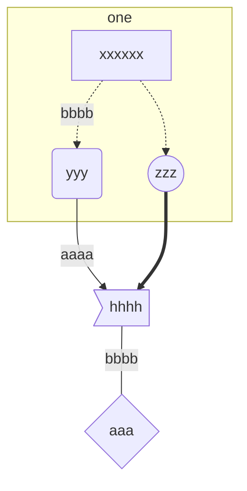
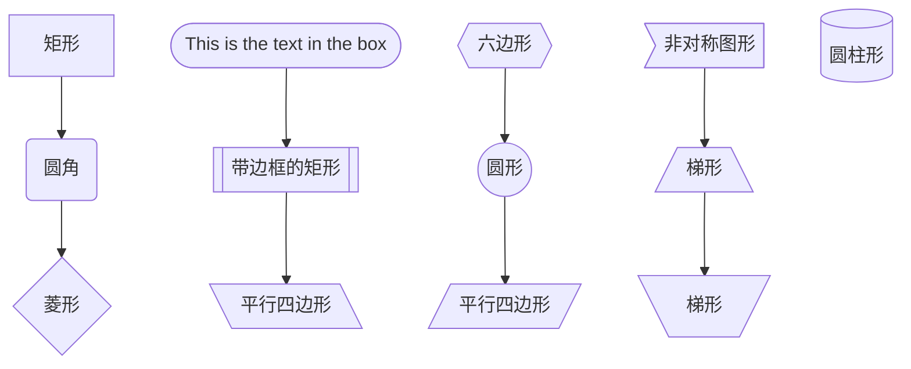
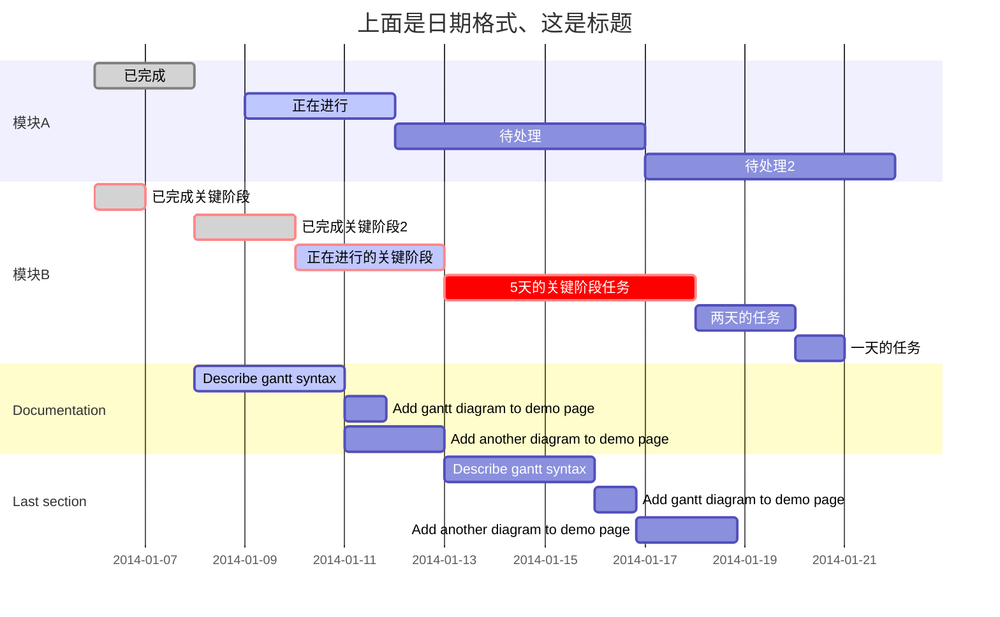

* content
{:toc}

## Markdown  
1.  markdown 可以直接添加html标记语句  如\<pre\>\<code\>
2.  \# 1-6空格 6级标题  
3.  \> 文本前面>标示引用句子  
4.  []() 插入链接。前面加！插入图片   
5.  *斜体*  **粗体**  ***斜粗体*** ~~带删除线~~ <u>下划线</u> <small>小</small> <big>大</big>
6.  \-无序列表  
7.  数字. 有序列表 
8.  \-\-\-分隔符  
9.  换行前一行末尾两个空格换行  
10. 四空格缩进或使用html标记代码块  
11. \$\$TeX 或 LaTeX 格式的数学公式\$\$  
12. \* content\{\:toc\}生成目录  
13. \<\> 显示括号中的地址，并生成超链接
14. 表格
  
        title1|title2|title3
        :--|--:|:--:
        c1|c2|c3

## GFM
01. 显示地址并生成超链接 直接输入无需括号  
02. \'\'\'name \'\'\' 代码块，bash, cmake, cpp, go, java, json, lua, markdown, perl, python, sql。 单个\'在文本中插入代码  
03. 对变量命中带_线的单词不会解析为粗体  

## Word
- brew install pandoc
- pandoc -s xx.docx -t markdown -o xx.md

## Mermaid
- TB BT LR RL
- 流程图




- 状态图
    ```mermaid
    stateDiagram-v2
        [*] --> Still: 开始
        Still --> [*]:退回
        
    	Still --> Moving
        Moving --> Still
    
    	Moving --> Crash
        Crash --> [*]
    ```
    ```mermaid
    stateDiagram-v2
	[*] --> First
	First --> Second
	First --> Third
	
	state First {
	    [*] --> fir
	    fir --> [*]
	}
	state Second {
	    [*] --> sec
	    sec --> [*]
	}
	state Third {
	    [*] --> thi
	    thi --> [*]
	}
	```
	
- 时序图
    ```mermaid
    sequenceDiagram
        participant A
        participant B
    	A->B: 吃了吗？
        B-->A: 吃了.
        B->>A: 你吃了吗？
        A-->>B: 我也吃了。
        A-xB: 以后别问我。
        B--xA: 疯了一个。
        loop 强迫模式
        	 A->B: 你傻吗？
        	 B-->A: 你才傻。
        	 Note left of A: 继续骂？
        	 alt 继续骂
        	 	A->B: 尻
        	 else 不继续
        	 	A->B: 不跟你计较
        	 end
        	 opt 管你继续不继续
        	 	B->A: 尻
        	 end
        end
    ```

    

- 甘特图



- 类结构

    ```mermaid
    classDiagram
          Animal <|-- Duck
          Animal <|-- Fish
          Animal <|-- Zebra
          Animal : +int age
          Animal : +String gender
          Animal: +isMammal()
          Animal: +mate()
          class Duck{
              +String beakColor
              +swim()
              +quack()
          }
          class Fish{
              -int sizeInFeet
              -canEat()
          }
          class Zebra{
              +bool is_wild
              +run()
          }
    ```

- 饼图

    ```mermaid
    pie
        "Dogs" : 386
        "Cats" : 85
        "Rats" : 150 
    ```

    

- git提交

    ```mermaid
    gitGraph:
    options
    {
        "nodeSpacing": 150,
        "nodeRadius": 10
    }
    end
    commit
    branch newbranch
    checkout newbranch
    commit
    commit
    checkout master
    commit
    commit
    merge newbranch
    ```

- 日程

    ```mermaid
    journey
        title My working day
        section Go to work
          Make tea: 5: Me
          Go upstairs: 3: Me
          Do work: 1: Me, Cat
        section Go home
          Go downstairs: 5: Me
          Sit down: 5: Me
    ```

## flowchart
- 定义元素 tag=>type: content:>url
- tag 元素标签用于流程时引用元素
- type 元素类型
    - start         开始
    - end           结束
    - operation     操作
    - subroutine    子程序
    - parallel      平行程序     标签(path1, bottom)->  标签(path2, top)->
    - condition     条件        标签(yes)->  标签(no)->
    - inputoutput   输入输出
- url 点击跳转链接
- 流程定义 标签A->标签B

```flow
a=>start: Start:>http://www.google.com[blank]
b=>operation: My Operation
c=>subroutine: My Subroutine
d=>condition: Yes or No?:>http://www.google.com
e=>inputoutput: catch something...
f=>parallel: parallel tasks
g=>end:>http://www.google.com
a->b->d
d(yes, bottom)->e->g
d(no, right)->f
f(path1, bottom)->c(right)->b
f(path2, top)->b
```

## echarts
```echarts 
{ 
    "chartWidth": 500, 
    "chartHeight": 400, 
    "series": [ 
    { 
        "name": "访问来源", 
        "type": "pie", 
        "radius": "55%", 
        "data": [ 
        { 
            "value": 235, 
            "name": "视频广告" 
        }, 
        { 
            "value": 274, 
            "name": "联盟广告" 
        }, 
        { 
            "value": 310, 
            "name": "邮件营销" 
        }, 
        { 
            "value": 335, 
            "name": "直接访问" 
        }, 
        { 
            "value": 400, 
            "name": "搜索引擎" 
        } 
        ] 
    } 
    ] 
} 
```

## sequence
```sequence
Alice->Bob: Hello Bob, how are you?
Note right of Bob: Bob thinks
Bob-->Alice: I am good thanks!
```

## latex
- ^ 幂次方
- _ 下标 如 a_1