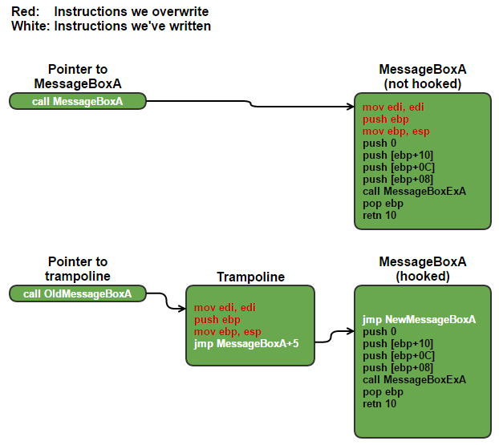

* content
{:toc}

# 概念
- TLS 传输安全协议
- SSL 安全套接字
- X.509 证书格式,定义字段及含义
- PEM 证书编码格式 -----BEGIN 开头 -----END 结尾 base64内容
- DER 证书编码格式 二进制 openssl x509 -in certificate.der -inform der -text -noout
- csr证书签名请求文件,包含公钥及相关信息
- crt后缀证书文件,常见于unix,大多为PEM格式,少部分DER格式
- cer后缀证书文件,常见于window,大多为DER格式,少部分PEM格式
- key一般非X.509格式的公私钥,编码可以为PEM或DER
- PFX/P12/JKS 将证书及私钥保存为一个文件PFX为window常用,JKS是java专用

## inline hook
- trampoline 跳床hook可以调用原函数
- trampoline 覆盖函数前5个字节, 保存5个字节到其它位置,要求这5个字节没有相对地址,基本是安全的


## ios hook 检测
- Method Swizzling 
```C
bool CheckHookForOC(const char* clsname, const char* selname)
{
    SEL sel = sel_registerName(selname);
    Class cls = objc_getClass(clsname);
    Method method = class_getInstanceMethod(cls, sel);
    if(!method) {
        method = class_getClassMethod(cls, sel);
    }
    IMP imp = method_getImplementation(method);

    Dl_info info;
    if(!dladdr((void*)imp, &info)){
        return false;
    }

    //路径不正确
    if(!strncmp(info.dli_fname, "/System/Library/Frameworks", 26)) {
        return false;
    }

    //非当前主程序名
    if(!strcmp(info.dli_fname, _dyld_get_image_name(0))){
        return false;
    }
      
    return true;
}
```

## M1 加载ios app
- 获取破解IPA 如越狱使用Frida解密IPA
- Sideloadly 使用一个不存在的iCloud账户签名IPA并安装IPA

## 公私钥
- 随机取两个不相等大质数 p,q
- 取两个数的乘积 n = p * q
- 欧拉函数得 φ(n) = φ(n) = φ(p * q) = φ(p) * φ(q)
- 随机取一个整数e, 使 1 < e < φ(n) && e 与 φ(n) 互质
- 计算 d = e 对 φ(n) 取模反元素(蒙哥马利算法)
- 公钥匙 (n, e)
- 私钥 (n, d)
- 加密数据看做n个整数, 且每个整数 < n
- 加密 C = (m ^ e) mod n
- 解密 m = (C ^ d) mod n

## TLS 1.2 隧道
- C -> S 版本、可用加密套件(密钥交换、签名)、可用压缩算法、随机数C、扩展信息
- C <- S 版本、选定加密套件(密钥交换、签名)、选定压缩算法、随机数S
- C <- S 下发公钥证书 Certificate
- C <- S 下发公钥、签名算法
- C <- S 完成
- C -> S 随机数3公钥加密发送
- C -> S 开始使用对称密钥
- C -> S 前面的消息签名使用前面三个随机数使用确定的密钥交换算法生成对称密钥
- C <- S 发送session ticket
- C <- S 开始使用对称密钥
- C <- S 解密随机数3,相同生成对称密钥,加密hash
