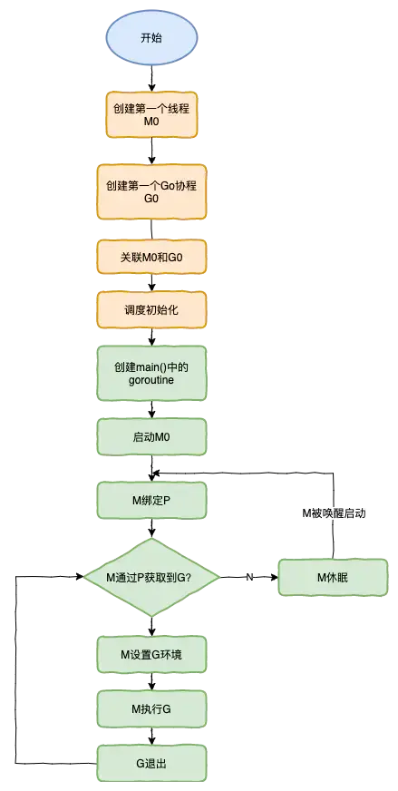

* content
{:toc}

## go1.5
1. GO15VENDOREXPERIMENT=1 替代GOPATH使用项目中的vendor目录
2. 查找顺序 当前包下的vendor目录->向上级目录查找vendor目录->GOROOT->GOPATH

## go1.7
1. 去掉GO15VENDOREXPERIMENT 默认使用

## go1.11
1. GO111MODULE=off|on|auto 取代vendor包管理
2. 项目脱离GOPATH可以放置于任意位置

## go1.14
1. type A interface {a() b()} type B interface {b() c()} type C interface {A B}
2. 实现问题
```go
        type Aa struct{}
        func (Aa) a() {}
        func (Aa) b() {}
        
        type Bb struct{}
        func (Bb) b() {}
        func (Bb) c() {}

        type Cc struct {
                C
        }

        func (Cc) b() {} //must define this func

        f := Cc {
                A: Aa{},
                B: Bb{},
        }
```
3. 协程调度用基于系统信号的异步抢占取代了协作式抢占, 有协程死循环也可以被切换出。但如果代码本身直接或间接调用syscall,调用平台相关API,可能触发系统信号,导致协程被切换,因此等切换回来必须检测EINTR错误,并重新调用syscall
4. -mod=mod 强制使用module包管理
5. GOINSECURE 不强制校验https证书

## go module
1. GO111MODULE=off|on|auto
2. go modules 在代码目录中生成go.mod go.sum
3. go install 将包安装到GOPATH/pkg/mod 编译到GOPATH/bin
4. go mod init 初始化go.mod 可以指定自定义名称
5. go mod download 下载package
6. go mod graph 打印模块依赖结构
7. go mod tidy 清理项目, 添加依赖包,删除未使用包
8. go mod verify 包校验
9. go mod why 查询需要的依赖包
10. go mod vendor 将依赖导出到vendor目录
11. go mod edit 编辑go.mod
12. go list -m -json all 用json格式打印依赖
13. go build 时会自动添加依赖并下载
14. go get 时会自动添加依赖到mod文件
15. go.mod

```
module github.com/nomadli/agent         //项目包路径
go 1.14                                 //使用的go版本
require (                               //用到的包
    example.com/apple v0.1.2
    example.com/banana v1.2.3
)

exclude example.com/banana v1.2.4       //忽略指定版本的依赖包
replace（                               //墙掉的库
    golang.org/x/crypto v0.0.0-20180820150726-614d502a4dac => github.com/golang/crypto v0.0.0-20180820150726-614d502a4dac
    golang.org/x/net v0.0.0-20180821023952-922f4815f713 => github.com/golang/net v0.0.0-20180826012351-8a410e7b638d
    golang.org/x/text v0.3.0 => github.com/golang/text v0.3.0
)
```
16. go.sum
```
<module> <version> <hash>               //hash h1:算法是第一版的hashsha256
<module> <version>/go.mod <hash>
```


## 协程切换
1. 用户态线程必须要绑定一个内核态线程
2. M(thread)启动时限制最大10000,debug时可以用SetMaxThreads动态设置限制。
3. P(Processor) 管理任务与线程, 启动时便创建完成,环境变量GOMAXPROCS或GOMAXPROCS()函数实时定义协程数量
4. P包含本地队列(<=256),当本地队列无可执行则去全局队列获取或从其它P获取. 本地队列满会将一半放回全局,
5. 新建G(goroutine)时, 会选择P去放入.
6. 启动时M与P相同, 当M阻塞或调用长时间的syscall会创建新的M
7. 
8. 打印调度信息 import "runtime/trace" f, err := os.Create("trace.db") err = trace.Start(f) trace.Stop() go tool trace trace.db
9. 打印调用信息 编译后 使用 GODEBUG=schedtrace=1000 ./a.exe

##环境
1.  https://golang.org/
2.  .bash_profile export GOROOT=/usr/local/go 
3.  export GOPATH=/Users/nomadli/src/golang
4.  export PATH=$PATH:$/bin:$GOPATH/bin
5.  export http_proxy=http://127.0.0.1:1087;
6.  export https_proxy=http://127.0.0.1:1087;
7.  export rsync_proxy=$http_proxy
8.  source ~/.bash_profile
9.  https://code.visualstudio.com/
10. 安装Go插件
11. Code->首选项->设置
12. go get -u -v github.com/nsf/gocode
13. go get -u -v github.com/rogpeppe/godef
14. go get -u -v github.com/zmb3/gogetdoc
15. go get -u -v github.com/golang/lint/golint
16. go get -u -v github.com/lukehoban/go-outline
17. go get -u -v sourcegraph.com/sqs/goreturns
18. go get -u -v golang.org/x/tools/cmd/gorename
19. go get -u -v github.com/tpng/gopkgs
20. go get -u -v github.com/newhook/go-symbols
21. go get -u -v golang.org/x/tools/cmd/guru
22. go get -u -v github.com/cweill/gotests
23. go get -v -u github.com/peterh/liner
24. go get -v -u github.com/derekparker/delve/cmd/dlv
25. brew install go-delve/delve/delve
26. 钥匙串访问->证书助理->创建证书 名称：dIv 身份类型：自签名证书 证书类型：代码签名 并选择“让我覆盖这些默认值” 
27. 重启Finder，再打开“钥匙串访问”，选择“系统”，就会看到创建好的“dlv-cert”证书
28. 右键”dlv-cert”证书，选择“显示简介->信任->代码签名”修改为：始终信任 
29. cd $GOPATH/src/github.com/derekparker/delve
30. GO15VENDOREXPERIMENT=1 CERT=dlv-cert make install
31. xcode-select --install
32. go build -o 输出文件名
33. go build -i 安装依赖包
34. go build/clean/get/install/list/run/test

        -a 完全编译,忽略-i产生的.a
        -n 打印编译输出,不实际编译
        -p 16 多核编译 默认检查cpu核数
        -race 检测数据竞争状态只支持amd64
        -msan
        -v 打印编译的包名
        -work 打印临时目录,并且退出时不删除
        -x 打印输出执行的命令
        -asmflags ‘xxxx’ 传递给go工具asm的调用参数
        -buildmode mode #shared static
        -compiler name 编译器
        -gccgoflags ‘’ gccgo编译器的编译参数
        -gcflags ‘’ 垃圾回收参数 =-m 分析逃逸
        -installsuffix suffix 安装前缀
        -ldflags packname.VarName= 为代码中变量赋值 如果编译版本、日期等
        -ldflags -s 去掉符号表
        -ldflags -w 去掉调试信息
        -linkshared 链接共享库
        -pkgdir dir 链接包信息位置
        -tags ‘’ 指定tag版本
        -toolexec ‘’ 替代编译链接等步骤使用的工具
35. sudo Visual\ Studio\ Code.app/Contents/MacOS/Electron --unity-launch
```shell
#最小化容器运行
docker pull scratch #只有rootfs没有kernel, kernel直接用系统的
CGO_ENABLED=1 GOOS=linux GOARCH=amd64 go build -tags "cgo netgo osusergo static_build" -ldflags '-linkmode=external -extldflags -static' ... #非PIE静态
CGO_ENABLED=1 GOOS=linux GOARCH=amd64 go build -tags "cgo netcgo osusergo static_build" -ldflags '-linkmode=external -extldflags -static -static-libgc -static-libgcc -static-libstdc++' ... #非PIE静态使用c net
CGO_ENABLED=1 GOOS=linux GOARCH=arm64 go build -buildmode=pie -tags "cgo netgo osusergo static_build" -ldflags '-linkmode=external -extldflags "-static -static-pie"' ... #PIE静态 仅arm64 其它不行
```

## 安装手机开发分支
01. .bash_profile export http_proxy https_proxy ...
02. go get golang.org/x/mobile/cmd/gomobile
03. gomobile init
04. 原生开发、兼容开发有限制 

## 原生开发 Android
01. gomobile build -target=android xx/xx/xxx
02. gomobile install xx/xx/xxx
03. 例子 go get -d golang.org/x/mobile/example/basic
04. 做动态库可以直接在Android Studio里面编译 

## 原生开发 IOS
01. gomobile build -target=ios xx/xx/xxx
02. ios-deploy https://github.com/phonegap/ios-deploy
03. ios-deploy -b xxx.app
04. 例子 go get -d golang.org/x/mobile/example/basic 
05. 作为库 gomobile bind -target=ios xx/xx/xx 

## web 网站
01. A Survey of 5 Go Web Frameworks 框架
02. Gorilla web toolkit 

## 兼容开发 Android
01. android studio
02. build.gradle 配置
03. 例子 go get -d golang.org/x/mobile/example/bind/android

## 兼容开发 IOS
01. gomobile bind -target=ios xx/xx/xxx 生成framework
02. 例子 go get -d golang.org/x/mobile/example/bind/ios

## 编译动态库
01. go build -buildmode=c-shared *.go

## 跨平台
01. CGO_ENABLED=0 GOOS=windows GOARCH=amd64 go build
02. CGO_ENABLED=0 GOOS=linux GOARCH=amd64 go build
3.  windows, unix, posix, plan9, darwin, bsd, linux, freebsd, nacl, netbsd, openbsd, solaris, dragonfly, bsd, notbsd, android, stubs
4.  amd64, none, 386, arm, arm64, mips64, s390,mips64x,ppc64x, nonppc64x, s390x, x86, amd64p32 riscv64
05. 文件后缀条件编译

        go list -f '{{.GoFiles}}' 目录   查看目录下将被编译的文件
        xxx_windows_386.go 只在window 386下被编译的文件
        xxx_unix_arm.go 只在unix兼容POSIX的平台上被编译的文件
        xxx_unix_arm_test.go 只在unix兼容POSIX的平台上的测试文件
        
06.  // +build 条件编译标签 在package前 并且要有空行

        // +build linux darwin  linux 或 darwin
        // +build 386           并且是386
        
        // +build linux, 386    linux 并且 386
        
        // +build !windows      非windows环境编译

## go vet
- 静态检查代码
- go vet ./...
- go test 会默认执行go vet

## go clean -cache
- 清除缓存
        
## go test
01. -c : 编译go test成为可执行的二进制文件，但是不运行测试。
02. -i : 安装测试包依赖的package，但是不运行测试。
03. build flags
04. packages
05. -v : 输出全部的单元测试用例默认只输出失败的单元测试用例。
06. -test.run pattern: 指定单元测试用例
07. -test.bench patten: 只跑那些性能测试用例
08. -test.benchmem : 是否在性能测试的时候输出内存情况
09. -test.benchtime t : 性能测试运行的时间，默认是1s, 30x代表30次
10. -test.cpuprofile cpu.out : 是否输出cpu性能分析文件
11. -test.memprofile mem.out : 是否输出内存性能分析文件
12. -test.blockprofile block.out : 是否输出内部goroutine阻塞的性能分析文件
13. -test.memprofilerate n : 内存性能分析的时候有一个分配了多少的时候才打点记录的问题。这个参数就是设置打点的内存分配间隔，也就是profile中一个sample代表的内存大小。默认是设置为512 * 1024的。如果你将它设置为1，则每分配一个内存块就会在profile中有个打点，那么生成的profile的sample就会非常多。如果你设置为0，那就是不做打点了。你可以通过设置memprofilerate=1和GOGC=off来关闭内存回收，并且对每个内存块的分配进行观察。
14. -test.blockprofilerate n: 基本同上，控制的是goroutine阻塞时候打点的纳秒数。默认不设置就相当于-blockprofilerate=1，每一纳秒都打点记录一下
15. -test.parallel n : 性能测试的程序并行cpu数，默认等于GOMAXPROCS。
16. -test.timeout t : 如果测试用例运行时间超过t，则抛出panic
17. -test.cpu 1,2,4 : 程序运行在哪些CPU上面，使用二进制的1所在位代表，和nginx的nginx_worker_cpu_affinity是一个道理
18. -test.short : 将那些运行时间较长的测试用例运行时间缩短
19. -test.count 3 指定测试几轮, bechtime*count=测试时长

## 语法
01. obj.(interface_name) 强制转为某种interface类型
02. func init(a int, b double, opt ... int) int64, char 
03. defer return后才执行

## [监控](https://golang.org/pkg/net/http/pprof)
- go tool pprof [options][binary] ...
    - \-text 纯文本
    - \-web 生成 svg 并用浏览器打开（如果 svg 的默认打开方式是浏览器)
    - \-svg 只生成 svg
    - \-list funcname 筛选出正则匹配 funcname 的函数的信息
    - \-http=":port" 直接本地浏览器打开 profile文件 查看（包括 top，graph，火焰图等）
    - go tool pprof -base profile1 profile2 对比两个profile
    - 命令行查看是可以使用的命令
    - flat: 采样时，该函数正在运行的次数*采样频率(10ms)，即得到估算的函数运行”采样时间”。这里不包括函数等待子函数返回。
    - flat%: flat / 总采样时间值
    - sum%: 前面所有行的 flat% 的累加值，如第三行 sum% = 71.24% = 27.56% + 50.58%
    - cum: 采样时，该函数出现在调用堆栈的采样时间，包括函数等待子函数返回。因此 flat <= cum
    - cum%: cum / 总采样时间值
    - topN [-cum] 查看前 N 个数据：
    - list ncname 查看某个函数的详细信息，可以明确具体的资源（cpu，内存等）是由哪一行触发的。
- runtime/pprof: 手动调用如runtime.StartCPUProfile或者runtime.StopCPUProfile等 API 来生成和写入采样文件，灵活性高。主要用于本地测试。
- pprof.StartCPUProfile(f)
- pprof.StopCPUProfile()
- pprof.Lookup("heap")
- pprof.Lookup("threadcreate")
- pprof.Lookup("block")
- pprof.WriteHeapProfile(f)
- pprof.StopHeapProfile()
- go test -bench . -cpuprofile cpuprofile.out生成采样文件，主要用于本地基准测试。可用于重点测试某些函数
- net/http/pprof go log.Println(http.ListenAndServe("ip:port", nil))
- go tool pprof http://ip:port/debug/pprof/profile?seconds=120 # 下载cpu profile  等待120s，不带此参数时等待30s
- go tool pprof http://ip:port/debug/pprof/heap #下载heap profile
- go tool pprof http://ip:port/debug/pprof/goroutine #下载goroutine profile
- go tool pprof http://ip:port/debug/pprof/block # 下载block profile
- go tool pprof http://ip:port/debug/pprof/mutex # 下载mutex profile
- curl http://ip:port/debug/pprof/trace?seconds=20 > trace.out # 下载20秒的trace记录（遇到棘手问题时，查看trace会比较容易定位) go tool trace trace.out 查看
- GOGCTRACE=1 或 命令行前加 GODEBUG=gctrace=1 跟踪gc
    - inuse：使用了多少 M 内存
    - idle：剩下要清除的内存
    - sys：系统映射的内存
    - released：释放的系统内存
    - consumed：申请的系统内存
    - gc xxx 表示第 xxx 次 gc
    - @x.xxs 表示程序执行的总时间
    - xx% 表示垃圾回收时间占用总的运行时间百分比
    - x.xx+y.y+z.zz ms clock 表示工作线程完成GC的stop-the-world,sweeping,marking和waiting的时间
    - x.x+y.y/z.z/d.d+c.c ms cpu 垃圾回收占用 cpu 时间
    - x->y->z MB 表示堆的大小，gc后堆的大小，存活堆的大小
    - x MB goal 整体堆的大小
    - x P 使用的处理器数量
    - scvg: inuse: 4, idle: 57, sys: 62, released: 57, consumed: 4 (MB) 表示系统内存回收信息
- GODEBUG=gctrace=1 godoc -index -http=:6060 2> stderr.log 然后 cat stderr.log | gcvis 图形化显示gc(https://github.com/davecheney/gcvis)
- GOGC 默认100 当堆内存达到初始时两倍时触发GC

## 监控 benchmark
- b.ReportAllocs() 输出单次循环使用的内存数量和对象 allocs 信息
- b.RunParallel() 使用协程并发测试
- b.SetBytes(n int64) 设置单次循环使用的内存数量
```shell
        go test -v xx_test.go -run=none -bench=. -benchtime=3s -cpuprofile cpu.prof -memprofile mem.prof
```
- run 知道单次测试，一般用于代码逻辑验证
- bench=. 执行所有 Benchmark，也可以通过用例函数名来指定部分测试用例
- benchtime 指定测试执行时长
- cpuprofile 输出 cpu 的 pprof 信息文件
- memprofile 输出 heap 的 pprof 信息文件。
- blockprofile 阻塞分析，记录 goroutine 阻塞等待同步（包括定时器通道）的位置
- mutexprofile 互斥锁分析，报告互斥锁的竞争情况
- GODEBUG=gctrace=1 go test -v *.go -bench=. -run=none -benchtime 3m |& gcvis 图形显示

## 栈对象逃逸为堆对象
- 指向栈对象的指针存于堆中；
- 指向栈对象的指针在栈对象回收后存活: 如返回局部变量的地址
- 动态类型 如函数参数为interface{}
- string slice map等包含指针的类型被函数捕获形成闭包。 即栈对象传入一个函数
- 栈空间不足
```go
//string 与 slice 互转不进行内存拷贝
func String(b []byte) string {
    return *(*string)(unsafe.Pointer(&b))
}
func Str2Bytes(s string) []byte {
    x := (*[2]uintptr)(unsafe.Pointer(&s))
    h := [3]uintptr{x[0], x[1], x[1]}
    return *(*[]byte)(unsafe.Pointer(&h))
}
```

## json
    type Product struct {
        Name string `json:"name,string"`
        NoJson int64 `json:"-"`// 表示不进行序列化
        num int `json:"num,omitempty"`//忽略0和nil
        Price float64 `json:"price,number"`
        IsOn  bool `json:"is_on,boolean"`
    }
    Value.Type().Field(i).Tag.Get("json")

## reflect unsafe
001. Type 
002. Value = reflect.ValueOf(interface{})
003. unsafe.Sizeof(struct) == struct size
004. unsafe.Sizeof(&v) === point size === 8
005. unsafe.Sizeof(string) === 16
006. (*reflect.StringHeader)(unsafe.Pointer(&string))获取string实际数据,{Data,Len}
007. unsafe.Sizeof([]byte) === 24
008. (*reflect.SliceHeader)(unsafe.Pointer(&[]byte))获取切片的实际数据,{Data,Len,Cap}
009. struct转[]byte

```go
var x reflect.SliceHeader
x.Len = int(unsafe.Sizeof(struct))
x.Cap = x.Len
x.Data = uintptr(unsafe.Pointer(&struct))
*(*[]byte)(unsafe.Pointer(&x))
```

010.   []byte转struct

```go
(*struct)(unsafe.Pointer(
        (*reflect.SliceHeader)(unsafe.Pointer(&[]byte)).Data,
))
}
```

011. interface结构

```go
type typeAlg struct {
	// function for hashing objects of this type
	// (ptr to object, seed) -> hash
	hash func(unsafe.Pointer, uintptr) uintptr
	// function for comparing objects of this type
	// (ptr to object A, ptr to object B) -> ==?
	equal func(unsafe.Pointer, unsafe.Pointer) bool
}
{
        typ {
                size       uintptr
	        ptrdata    uintptr  // number of bytes in the type that can contain pointers
	        hash       uint32   // hash of type; avoids computation in hash tables
	        tflag      uint8    // tflagUncommon tflagExtraStar tflagNamed
	        align      uint8    // alignment of variable with this type
	        fieldAlign uint8    // alignment of struct field with this type
	        kind       uint8    // enumeration for C
	        alg        *typeAlg // algorithm table
	        gcdata     *byte    // garbage collection data
	        str        int      // string form
	        ptrToThis  int      // type for pointer to this type, may be zero
        }
        word unsafe.Pointer
}

## Value 
1. nil只能调用 IsValid String Kind !=reflect.Ptr为nil
2. Kind reflect.Struct reflect.Slice reflect.Array reflect.Map reflect.Func 不是具体类
3. Type() 具体类型
4. CanAddr() Addr()
5. Elem() Kind()==reflect.Interface || reflect.Ptr 可调返回内容或指针
6. Set(reflect.New(v.Type()) Type必须不是指针，所以循环Elem到非指针
7. Type().NumMethod()
8. Type().NumField() Type().Field(i).Tag.Get("json")
9. Type().Name()

## cgo
01. go tool cgo xx/xx.go 生成C中间文件
02. export PKG_CONFIG_PATH=
03. export LD_LIBRARY_PATH=
04. +build !static +build static_all  
05. \#cgo pkg-config: --static libname
06. \#cgo LDFLAGS: -static -llibnmae -Wl -Bstatic -Bdynamic -L..
07. 文件名约束 xx_linux.go xx_windows_amd64.go 
08. +build linux,386 darwin,!cgo 
09. \#cgo [darwin linux windows] CFLAGS: -I ${SRCDIR}/...
10. testing 不能直接使用cgo,将cgo定义在其他文件中,并直接调用实际生成的go代理函数
```go
//go 调用时间检测 调用可执行文件时 time taskset -c 10 xx/xx
package main
import _ "unsafe"
//go:noinline
func add3(a, b, c int) int {
    return a + b + c
}
//go:linkname nanotime runtime.nanotime
func nanotime() int64                       //需有xx_amd64(|x86_64|..).s汇编文件,空文件也可以
const num int = 10000000
func main() {
    var sum int = 0
    t1 := nanotime()
    for i := 0; i < num; i ++ {
        sum = add3(i, i+1, i+2)
    }
    t2 := nanotime()
    println("Time: ", float64(t2-t1)/float64(num), " ns/Op")
    println("Result:", sum)
}

//go 调用C时间检测 import "C" 导致无法使用//go:linkname 编译指令 在同package下导入nanotime
//go 直接使用编译后C函数地址,不使用go包装
package main
/*
#include <stdio.h>
typedef struct passer passer;
struct passer {
    int p0;
    int p1;
    int p2;
    int r;
};
int __attribute__((noinline)) x_csub(void *v) {
    passer* pv = (passer*)v;
    pv->r = pv->p0 + pv->p1 + pv->p2;
}
*/
import "C"
const num int32 = 10000000
func main() {
    var sum int32 = 0
    var i int32
    t1 := nanotime()
    for i = 0; i < num; i++ {
        sum = add3(i, i+1, i+2)
    }
    t2 := nanotime()
    println("Time: ", float64(t2-t1)/float64(num), " ns/Op")
    println("Result:", sum)
}
//另一个文件
package main
import "unsafe"
//go:linkname asmcgocall runtime.asmcgocall
func asmcgocall(fn, arg unsafe.Pointer) int32
//go:linkname nanotime runtime.nanotime
func nanotime() int64
//go:cgo_import_static x_csub
//go:linkname x_csub x_csub
//go:linkname px_csub px_csub
var x_csub byte
var px_csub = unsafe.Pointer(&x_csub)
type passer struct {
    a, b, c, r int32
}
var p passer
func add3(a, b, c int32) (r int32) {
    p.a = a
    p.b = b
    p.c = c
    p.r = r
    asmcgocall(px_csub, unsafe.Pointer(&p))
    return p.r
}

//go 在当前goroutine的堆栈上直接调用C
//第一个文件、第二个文件与上方相同 第二个文件import 新增的三个文件
package mycall
import "unsafe"
func Mycall(fn, arg unsafe.Pointer)
//汇编文件
TEXT ·Mycall(SB),0,$0-20
MOVQ fn+0(FP), AX
MOVQ arg+8(FP), BX
MOVQ BX, DI
CALL AX
RET

//go 将C函数伪装为Go的函数

```

## go 命令
1. go list ./... 列出所有当前目录及子目录中的go源文件
2. go env 显示go环境变量,可以指定显示key如GOPATH

## C、C++ 协程库
- libco https://github.com/Tencent/libco.git
- libgo https://github.com/yyzybb537/libgo.git

## go 启动过程
1. goruntime goexit
2. goruntime func main()
3. 引用的库递归init函数->mian.init

## go 常用函数

方法|作用
:--|:--
runtime.GOOS|判断操作系统
os.Args|命令行参数
os.Environ|系统环境变量
string os.Getwd|当前绝对目录
FileInfo os.Stat|文件目录信息
FileInfo.IsDir|是否文件
File os.Open|打开文件
PrivateKey rsa.GenerateKey|生成密钥
Signer NewSignerFromSigner|生成签名
PublicKey ParseAuthorizedKey|从文件加载密钥
[]byte Marshal|序列化密钥
net.Listen|监听数据流
net.ListenPacket|监听数据块
Accept|接收数据流链接
net.Dial|链接远程
ServerConn ssh.NewServerConn|将链接传给ssh握手
net.Addr ServerConn.RemoteAddr|获取远程地址
User user.Current|获取当前用户
User.HomeDir|获取主目录
Cmd exec.Command|执行命令的环境进程
Cmd.Env|环境变量
Cmd.StdinPipe|标准输入
Cmd.Stdout|标准输出
Cmd.Stderr|错误输出
Cmd.Run|执行命令

## 三方库
1. tarsgo http网关

## upx 程序压缩, 插入解压壳
