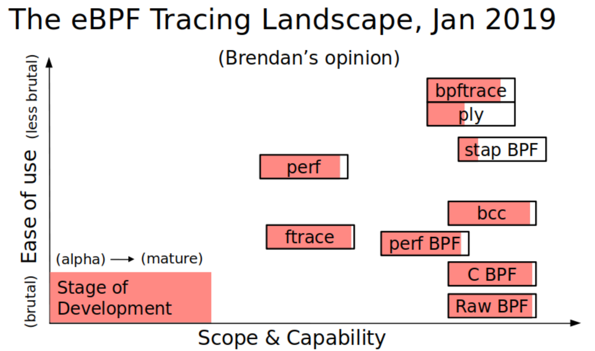

* content
{:toc}

## book
1.  http://docs.oracle.com/cd/E19253-01/819-6959/
2.  https://docs.oracle.com/cd/E19253-01/819-6959/819-6959.pdf
3.  DTrace-Dynamic-Tracing-in-Oracle-Solaris-Mac-OS-X-and-FreeBSD 

## pragma
01. pragma D 指定特定的编译指令
02. pragma D attributes 名称稳定性/数据稳定性/依赖 provider providername (provider、module、function、name、args)  稳定性包括:Internal(内部)、Private(专用)、Obsolete(过时)、External(外部)、Unstable(不稳定)、Evolving(发展中)、Stable(稳定)、Standard(标准) 依赖包括:Unknown(未知)、CPU(特性cpu)、Platform(系列cpu)、Group(某种架构的cpu)、ISA(特定指令集)、Common(通用)。
03. pragma D option 选项: aggrate(聚合读取的速率)、aggsize(聚合缓冲区大小)、bufresize(缓冲区调整大小策略)、bufsize(主体缓冲区大小)、cleanrate(清除速率hz)、cpu(启用跟踪的CPU)、defaultargs(允许引用未指定的宏参数)、destructive(允许破坏性操作)、dynvarsize(动态变量空间大小)、flowindent(缩进函数输入并加前缀 ->；取消缩进函数返回并加前缀 <-)、grabanon(声明匿名状态)、jstackframes(jstack() 的缺省栈帧数)、jstackstrsize(jstack() 的缺省字符串空间大小)、nspec(推理数)、quiet(仅输出显式跟踪的数据)、specsize(推理缓冲区大小)、strsize(字符串大小)、stackframes(栈帧数)、stackindent(缩进 stack() 和 ustack() 输出时要使用的空格字符数)、statusrate(状态检查的速率)、switchrate(缓冲区切换的速率)、ustackframes(用户栈帧数)、version(dtrace版本)

## 探针描述
01. dtrace:::BEGIN 脚本开始时执行
02. dtrace:::END 脚本退出时执行
03. dtrace:::ERROR 脚本错误时执行 
04. sudo dtrace -l | awk '{ match($2, "([a-z,A-Z]*)");print substr($2, RSTART, RLENGTH); }' | sort -u 列出所有可用探针
05. tick-10sec 每10秒执行 在一个cpu上触发
06. profile-1001 每1001赫兹执行 在所有cpu上触发
07. pid123:libSystem:printf:return pid为123的print函数
08. objc123:NSTableView:draw?:entry pid为123obj类函数
09. io::: start done wait-start wait-done journal-start journal-done
10. ip:::send ip:::receive arg0-arg5
11. 自定义静态探针 provider name{probe name(param)} name.d dtrace -h -s name.d 
12. 多个探针可以用','进行分隔
13. :entry :return 函数进入和退出

## 断言
01. 条件可使用 && || / a == b && c == d /

## 语句
01. sum(...) 集积函数 对key对应的值累加
02. count() 集积函数 对key对应的函数调用次数
03. avg(...) 集积函数 对key对应的值平均值
04. min(...) 集积函数 对key对应的值最小
05. max(...) 集积函数 对key对应的值最大
06. lquantize()  集积函数 线性统计
07. quantize()  集积函数 非线性统计
08. trunc(@name, number)集积函数 截断
09. printa(...) 打印集积
10. clear(@name) 清除集积
11. normalize(@name, .) 标准化集积
12. trace() 打印信息
13. exit(0) 退出Dtrace
14. printf格式化输出
15. tracemem(addr, len) 打印内存
16. stack(deepth) 打印内核栈 可以不指定深度
17. ustack(deepth, strsize) 打印用户栈,参数可不指定
18. jstack(deepth, strsize) ustack别名, strsize默认>0
19. stop()触发探测器的进程在退出内核时被强制停止
20. raise(int signal)发送信号给进程
21. copyout(buf,addr,size) 从buf拷贝size到addr内存
22. copystr(str,addr,maxlen)从str拷贝maxlen到addr
23. system(program,...)执行系统命令可以用格式化字符生成命令,只在处理Dtrace缓存区时才开始执行,并不在调用当时执行
24. breakpoint() 内核断点
25. panic()系统奔溃转储
26. chill(nanoseconds) 相当于sleeep
27. void* alloca(size) 分配零时空间，出{}会自动释放
28. basename(str)复制str不包括/结尾的前缀，临时空间自动释放
29. bcopy(str,dest,size)str在临时内存外，dest在零时内存内
30. cleanpath(str)返回有效路径 临时内存外部
31. void* copyin(addr, size)拷贝addr到临时缓存区
32. string copyinstr(addr)
33. void copyinto(saddr,size,daddr)
34. string dirname(path)返回目录内容
35. size_t msgdsize(mblk_t *mp) 返回数据字节数
36. size_t msgsize(mblk_t *mp) 返回字节总数
37. int mutex_owned(kmutex_t *mutex)返回当前内核mutex
38. kthread_t* mutex_owner(kmutext_t *mutex)返回内核mutext的线程指针
39. int mutex_type_adaptive(kmutex_t *mutex)判断内核互斥是否为MUTEX_ADAPTIVE类型
40. int progenyof(pid_t pid)判断是否是指定的进程
41. int rand(void)返回伪随机数
42. int rw_iswriter(krwlock_t *rwlock)是否是写锁或写等待锁
43. int rw_write_held(krwlock_t *rwlock)是否写锁定
44. int speculation()
45. string strjoin(str1, str2)连接两个字符串 临时缓存外部
46. size_t strlen(str)字符长度
47. translator structtype1 < structtype2 name > 自动结构转换 2->1
48. xlate <structtype1>(structtype2)->name 运算符自动转换
49. inline 指令定义 D 命名的常量

## 变量
01. 全局(name)、线程本地(self->name)、 探针语句本地{name}
02. 集积 @name 对某个key进行累计
03. 联合数组 int x[unsigned long long, char]; 
04. $1 表示Dtrace 命令的第一个参数 
06. errno int 系统调用的当前 errno 值
07. ‘name 访问操作系统的变量 数据结构 类型
08. int64_t arg0, ..., arg9 探测器的前10个输入参数表示为原始的64位整数
09. args[] 当前探测器键入的参数 实际类型
10. uintptr_t caller 当前线程的程序计数器位置
11. chipid_t chip	当前物理芯片的 CPU 芯片标识符
12. processorid_t cpu 当前 CPU 的 CPU 标识符
13. cpuinfo_t \*curcpu 当前 CPU 的 CPU 信息
14. lwpsinfo_t \*curlwpsinfo 当前线程LWP 状态
15. psinfo_t \*curpsinfo 当前线程关联的进程的进程状态
16. kthread_t \*curthread 当前线程的操作系统内核的内部数据结构的地址
17. string cwd 与当前线程关联的进程的当前工作目录名称。
18. uint_t epid 当前探测器的已启用的探测器 ID
19. int errno 线程最后一次执行的系统调用返回的错误值
20. string execname 当前进程的名称
21. gid_t gid	当前进程的实际组 ID
22. uint_t id 探测器ID。系统范围内的唯一标识符
23. uint_t ipl 触发探测器时当前 CPU 的中断优先级
24. lgrp_id_t lgrp 当前 CPU 所属的延迟组的延迟组 ID
25. pid_t pid 当前进程的进程 ID
26. pid_t ppid 当前进程的父进程 ID
27. string probefunc 探测器函数名称部分
28. string probemod 探测器模块名称部分
29. string probename 探测器名称部分
30. string probeprov 探测器提供器名称部分
31. psetid_t pset 当前 CPU 的处理器集的处理器集 ID
32. string root 当前线程关联的进程的根目录名称
33. uint_t stackdepth 触发探测器时当前线程的栈帧深度
34. id_t tid 当前线程的线程 ID
35. uid_t uid 当前进程的实际用户 ID
36. uint64_t uregs[] 当前线程已保存的用户模式寄存器值
37. uint64_t timestamp 纳秒相对时间
38. uint64_t vtimestamp 纳秒当前线程已运行时间减去花费时间
39. uint64_t walltimestamp 1970-1-1-00:00纳秒

## xcode
01. 创建d文件
02. provider 名称 {}; 定义提供者
03. probe name(args...) 定义探针
04. 将d文件添加进xcode
05. ios项目head search path add $(DERIVED_FILES_DIR)
06. 使用的地方#import d文件名.h
07. providename_probename、 providename_probename_enabled
08. DTRACE_PROBES_DISABLED 关闭dtrace  

## linux 系统追踪
- SystemTap ktap sysdig LTTng bcc cBPF eBPF
- ebpf 需要内核在3.15以上, 5.5以上才好用, 5.8引入了ring buffer
- [ebpf工具](https://ebpf.io/projects)
- linux 中BPF是内核支持的,其它要么使用了BPF,要么在特定领域使用
- [BPF 在liunx上的使用](https://github.com/torvalds/linux/tree/master/samples/bpf)
    - 
    - 
    - [字节码 非常灵活, 但非常难编码](sock_example.c)
    - [c 语言 难度大](tracex1_kern.c tracex1_user.c)
    - perf [使用perf_event实现](https://github.com/brendangregg/perf-tools)
    - bcc python 实现的一个编译器, 实现类C的开发
    - bpftrace c的开发库, 有局限
    - [ply 局限性](https://github.com/iovisor/ply)
    - libbpf 纯C库, 生成BPF字节码, 运行时动态判断内核版本, 更新BPF字节码, 加载内核编译
- centos
    ```shell
    yum update -y
    rpm --import https://www.elrepo.org/RPM-GPG-KEY-elrepo.org
    rpm -Uvh http://www.elrepo.org/elrepo-release-7.0-2.el7.elrepo.noarch.rpm
    rpm -qa |grep kernel
    yum remove -y kernel-headers kernel-tools kernel-tools-libs kernel-debug-devel 旧内核名(不含arch名) clang llvm
    yum --enablerepo=elrepo-kernel install -y kernel-ml kernel-ml-devel kernel-ml-headers kernel-ml-tools kernel-ml-tools-libs
    grub2-mkconfig -o /boot/grub2/grub.cfg
    awk -F\' '$1=="menuentry " {print i++ " : " $2}' /etc/grub2.cfg
    grub2-set-default 0
    grub2-editenv list
    yum -y groupinstall "Development Tools"
    yum -y install zlib-devel openssl-devel python3 elfutils-libelf-devel
    #gcc 11 无法直接用gcc 4.x编译
    wget https://mirrors.aliyun.com/gnu/gcc/gcc-10.3.0/gcc-10.3.0.tar.xz
    wget https://mirrors.aliyun.com/gnu/gcc/gcc-11.1.0/gcc-11.1.0.tar.xz
    tar -xvf gcc-11.1.0.tar.xz
    cd gcc-11.1.0
    ./contrib/download_prerequisites
    mkdir build
    cd build
    ../configure --prefix=/usr --mandir=/usr/share/man --infodir=/usr/share/info --with-bugurl=http://bugzilla.redhat.com/bugzilla --enable-bootstrap --enable-shared --enable-threads=posix --enable-checking=release --with-system-zlib --enable-__cxa_atexit --disable-libunwind-exceptions --enable-gnu-unique-object --enable-linker-build-id --with-linker-hash-style=gnu --enable-languages=c,c++,go --enable-plugin --enable-initfini-array --disable-libgcj --enable-gnu-indirect-function --with-tune=generic --with-arch_32=x86-64 --build=x86_64-redhat-linux --disable-multilib --with-default-libstdcxx-abi=gcc4-compatible --with-abi=m64 --enable-offload-targets=nvptx-none --without-cuda-driver --enable-checking=release  --with-target-system-zlib --enable-objc-gc=auto  --enable-gnu-unique-object --disable-vtable-verify --enable-libmpx --enable-clocale=gnu --enable-libstdcxx-debug --enable-libstdcxx-time=yes --enable-nls --without-included-gettext
    unset LIBRARY_PATH CPATH C_INCLUDE_PATH PKG_CONFIG_PATH CPLUS_INCLUDE_PATH INCLUDE
    make -j16
    make install
    wget https://github.com/Kitware/CMake/releases/download/v3.20.2/cmake-3.20.2.tar.gz
    tar -xvf cmake-3.20.2.tar.gz
    cd cmake-3.20.2
    ./bootstrap --prefix=/usr
    make -j16
    make install
    wget https://github.com/llvm/llvm-project/releases/download/llvmorg-12.0.0/llvm-12.0.0.src.tar.xz
    wget https://github.com/llvm/llvm-project/releases/download/llvmorg-12.0.0/clang-12.0.0.src.tar.xz
    wget https://github.com/llvm/llvm-project/releases/download/llvmorg-12.0.0/clang-tools-extra-12.0.0.src.tar.xz
    wget https://github.com/llvm/llvm-project/releases/download/llvmorg-12.0.0/compiler-rt-12.0.0.src.tar.xz
    wget https://github.com/llvm/llvm-project/releases/download/llvmorg-12.0.0/libcxx-12.0.0.src.tar.xz
    wget https://github.com/llvm/llvm-project/releases/download/llvmorg-12.0.0/libcxxabi-12.0.0.src.tar.xz
    wget https://github.com/llvm/llvm-project/releases/download/llvmorg-12.0.0/lldb-12.0.0.src.tar.xz
    tar -xvf llvm-12.0.0.src.tar.xz
    tar -xf clang-12.0.0.src.tar.xz
    mv clang-12.0.0.src clang
    tar -xf clang-tools-extra-12.0.0.src.tar.xz
    mv clang-tools-extra-12.0.0.src clang-tools-extra
    tar -xf compiler-rt-12.0.0.src.tar.xz
    mv compiler-rt-12.0.0.src compiler-rt
    tar -xf libcxx-12.0.0.src.tar.xz
    mv libcxx-12.0.0.src libcxx
    tar -xf libcxxabi-12.0.0.src.tar.xz
    mv libcxxabi-12.0.0.src libcxxabi
    tar -xf lldb-12.0.0.src.tar.xz
    mv lldb-12.0.0.src lldb
    cd llvm-12.0.0.src
    mkdir build
    cd build
    unset LIBRARY_PATH CPATH C_INCLUDE_PATH PKG_CONFIG_PATH CPLUS_INCLUDE_PATH INCLUDE
    cmake -DCMAKE_INSTALL_PREFIX=/usr -DCMAKE_BUILD_TYPE=Release -DLLVM_ENABLE_ASSERTIONS=on -DLLVM_ENABLE_PROJECTS="clang;clang-tools-extra;compiler-rt;lldb;libcxx;libcxxabi" ..
    make -j16
    make install
    git clone https://github.com/lldb-tools/lldb-mi
    cd lldb-mi
    mkdir build
    cd build
    cmake -DCMAKE_INSTALL_PREFIX=/usr -DCMAKE_PREFIX_PATH=/usr ..
    make -j16
    make install
    ```
- c 语言
    - 直接编译进内核
    ```shell
        yum install -y epel-release
        yum update -y
        yum groupinstall -y "Development tools"
        yum install -y elfutils-libelf-devel cmake3 git bison flex ncurses-devel
        zlib libz-dev zlib-devel libelf libelf-devel futils-libelf-devel libbpf
        install or build install llvm  >= 10
        install or build install clang >= 10
        linux 内核代码  make defconfig && make headers_install
        编写内核bpf探针 samples/bpf/xxx_kern.c
            #include <linux/bpf.h>
            #include "bpf_helpers.h"
            #define SEC(NAME) __attribute__((section(NAME), used))
            SEC("tracepoint/syscalls/sys_enter_execve")
            int bpf_prog(void *ctx){
	            char msg[] = "nomadli's bpf program!\n";
	            bpf_trace_printk(msg, sizeof(msg));
	            return 0;
            }
            char _license[] SEC("license") = "GPL";
        
        编写用户态使用 samples/bpf/xxx_user.c
        #include <stdio.h>
        #include "bpf_load.h"
        int main(int argc, char **argv){
	        if(load_bpf_file("xxx_kern.o")!=0){
		        printf("The kernel didn't load BPF program\n");
		        return -1;
	        }
	        read_trace_pipe();
	        return 0;
        }
        修改Makefile 添加
        hostprogs-y += hello
        hello-objs := bpf_load.o hello_user.o
        always += hello_kern.o
        make M=samples/bpf
    ```
    - 手动加载如内核
    ```shell
        #与直接加载内核相同, 写xxx_kern.c
        #always += hello_kern.o
        #make M=samples/bpf
        llm-objdump -arch-name=bpf -S hello_kern.o 获取函数开始及长度
        dd if=/xx/hello_kern.o of=/xx/hell_kern bs=1 count=函数二进制字节长度 skip=函数开始位置(头64字节)
        #获取相关event id, 如kprodb的id
        echo 'p:sys_clone sys_clone' >> /sys/kernel/debug/tracing/kprobe_events
        cat /sys/kernel/debug/tracing/events/kprobes/sys_clone/id
        #客户端代码
        #include <unistd.h>
        #include <string.h>
        #include <sys/syscall.h>
        #include <stdlib.h>
        #include <stdio.h>
        #include <sys/stat.h>
        #include <fcntl.h>
        #include <linux/bpf.h>
        #include <linux/version.h>
        #include <linux/perf_event.h>
        #include <linux/hw_breakpoint.h>
        #include <errno.h>
        int main() {
            int bfd = open("/xx/hell_kern", O_RDONLY);
            if (bfd < 0)
            {
                printf("open eBPF program error: %s\n", strerror(errno));
                exit(-1);
            }

            unsigned char buf[1024] = {};
            int n = read(bfd, buf, 1024);
            for (int i = 0; i < n; ++i) {
                printf("%02x ", buf[i]);
                if (i % 8 == 0)
                    printf("\n");
            }
            close(bfd);

            struct bpf_insn *insn = (struct bpf_insn*)buf;
            unsigned char log_buf[4096] = {};

            union bpf_attr attr = {};
            attr.prog_type = BPF_PROG_TYPE_KPROBE;
            attr.insns = (unsigned long)insn;
            attr.insn_cnt = n / sizeof(struct bpf_insn);
            attr.license = (unsigned long)"GPL";
            attr.log_size = sizeof(log_buf);
            attr.log_buf = (unsigned long)log_buf;
            attr.log_level = 1;
            attr.kern_version = 264656;

            int pfd = syscall(SYS_bpf, BPF_PROG_LOAD, &attr, sizeof(attr));
            if (pfd < 0) {
                printf("bpf syscall error: %s\n", strerror(errno));
                printf("log_buf = %s\n", log_buf);
                exit(-1);
            }

            struct perf_event_attr pattr = {};
            pattr.type = PERF_TYPE_TRACEPOINT;
            pattr.sample_type = PERF_SAMPLE_RAW;
            pattr.sample_period = 1;
            pattr.wakeup_events = 1;
            pattr.config = 1234;#kprodb 的 id
            pattr.size = sizeof(pattr);
            int efd = syscall(SYS_perf_event_open, &pattr, -1, 0, -1, 0);
            if (efd < 0) {
                printf("perf_event_open error: %s\n", strerror(errno));
                exit(-1);
            }
            
            int ret = ioctl(efd, PERF_EVENT_IOC_ENABLE, 0);
            if (ret < 0) {
                printf("PERF_EVENT_IOC_ENABLE error: %s\n", strerror(errno));
                exit(-1);
            }

            ret = ioctl(efd, PERF_EVENT_IOC_SET_BPF, pfd);
            if (ret < 0) {
                printf("PERF_EVENT_IOC_SET_BPF error: %s\n", strerror(errno));
                exit(-1);
            }

            while(1); #不退出看结果
        }
    ```
- [libbpf](https://github.com/libbpf/libbpf-bootstrap)
    ```shell
    #sameple git@github.com:iovisor/bcc.git
    #linux 内核编译后会生成一个ELF文件叫vmlinux, 其包含了完整的linux内核
    #bpftool 在linux内核/toos/bpf/目录下
    #bpftool 工具可以读取vmlinux并导出内核中数据结构定义, sys/type.h可以替代？
    #bpftool btf dump file /sys/kernel/btf/vmlinux format c > vmlinux.h
    #代码

    #!/usr/bin/env bash

    src_path=$(cd $(dirname $0); pwd)
    ARCH=`uname -m | sed "s/x86_64/x86/"`
    BPF_FLAG="-g -target bpf -D__TARGET_ARCH_${ARCH} -I/usr/include -isystem /home/baoleiji/test"
    BUILD_FLAG="-g -Wall -I/home/baoleiji/test/uapi -I/home/baoleiji/test"

    while getopts ":k:b:l:d:h:" opt
    do
        case $opt in
            k)
                clang ${BPF_FLAG} -c ${OPTARG}.c -o ${OPTARG}.o
                if [[ $? -ne 0 ]]; then
                    exit 1
                fi
                ${src_path}/bpftool gen skeleton ${OPTARG}.o > ${OPTARG}.h
                if [[ $? -ne 0 ]]; then
                    exit 2
                fi
                sed -i -e 's/#include <bpf\/libbpf.h>/#include \"bpf\/libbpf.h\"/g' ${OPTARG}.h
                ;;
            b)
                clang ${BUILD_FLAG} -c ${OPTARG}.c -o ${OPTARG}.o
                ;;
            l)
                infiles=""
                index=0
                for param in $@; do
                    let index+=1
                    if [[ ${index} -eq 1 ]]; then
                        continue
                    fi
                    infiles="${infiles} ${param}.o"
                done
                clang -g -Wall ${infiles} -lelf -lz -lbpf -o $2
                ;;
            d)
                llvm-objdump --arch-name=bpf -S ${OPTARG}.o
                ;;
            h)
                hexdump ${OPTARG}.o
                ;;
        esac
    done
    ```