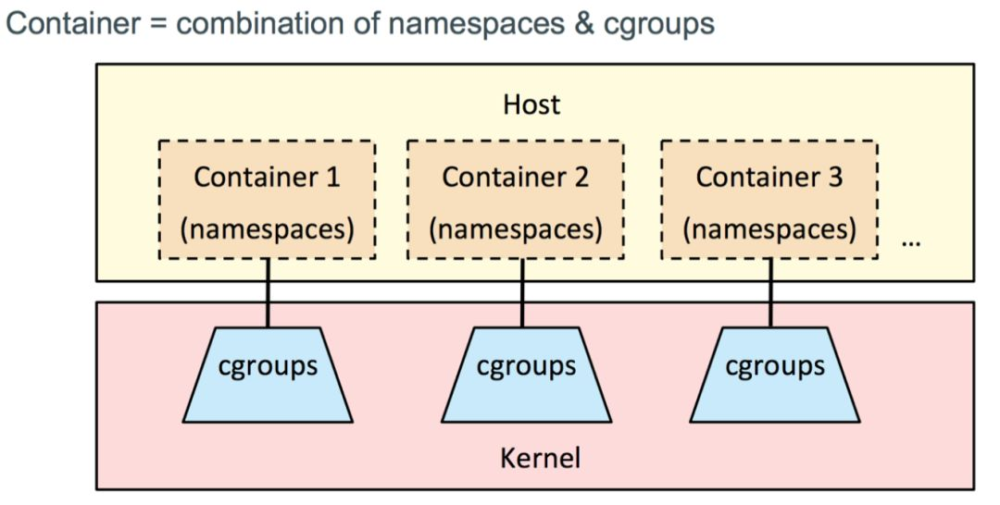

* content
{:toc} 

# 原理
01. 
02. namespace 六种隔离
    
        #include<sched.h>
        clone(int(*func)(void*),    线程函数
              void *stackbuf,       线程函数的栈buf
              int flags,            下面的6种隔离的位或
              void *arg, ...)       函数参数
        PID	    CLONE_NEW_PID	隔离进程编号
        UTS	    CLONE_NEWUTS	   主机名
        IPC	    CLONE_NEWIPC	   进程通讯相关的，信号量、消息队列、内存映射
        Network  CLONE_NEWNET	   网络协议栈、ARP表、路由表、NAT表
        Mount    CLONE_NEWNS	   文件系统挂载点
        User	    CLONE_NEWUSER	用户、组名

03.  CGroup 资源隔离

        创建或下载镜像文件系统github.com/CentOS/sig-cloud-instance-images
        在clone的线程函数中执行
        在解压目录(root_path)创建proc目录修改权限为0x755
        mount("proc", proc_path, "proc")
        mount("root", root_path, "", MS_BIND|MS_REC)
        在root_path创建.pivot_root目录权限0x700
        pivot_root(root_path， pivot_root_path)
        umoount("/.pivot_root", MNT_DETACH)
        

# 基本命令
- docker --version
- docker-compose --version
- docker-machine --version
- docker pull xxx 下载image xxx
- docker build --no-cache -t xxx:xxx . 创建image
- docker images 显示已有的image
- docker rmi xxx 删除image xxx
- docker run -itd -p 80:80 --name webserver imagename 运行容器并起别名
- docker ps 展示目前启动的容器
- docker ps -a 展示所有容器
- docker inspect xx 显示当前容器详细配置
- docker start 启动容器
- docker stop 停止容器
- docker rm -f webservr 停止并删除容器，但不会删除镜像
- docker exec -it xxx /bin/bash 运行容器并进入shell -u root 以root用户
- docker attach xxx 进入运行中的容器
- docker commit xxx xx:xx 将content打包为镜像
- docker export xxx -o xxx.tar 将content转为xxx.tar
- docker save -o xxx.tar xxx:xx 将容器镜像打包
- docker load -i xxx.tar 加载容器镜像 

# PostgreSQL基础镜像
01. Dockerfile 
   FROM debian:jessie
	RUN mv /etc/apt/sources.list /etc/apt/sources.list.bak && \
   		echo "deb http://mirrors.163.com/debian/ jessie main non-free contrib" >/etc/apt/sources.list && \
    	echo "deb http://mirrors.163.com/debian/ jessie-proposed-updates main non-free contrib" >>/etc/apt/sources.list && \
    	echo "deb-src http://mirrors.163.com/debian/ jessie main non-free contrib" >>/etc/apt/sources.list && \
    	echo "deb-src http://mirrors.163.com/debian/ jessie-proposed-updates main non-free contrib" >>/etc/apt/sources.list
	RUN echo "deb http://apt.postgresql.org/pub/repos/apt/ xenial-pgdg main" >> /etc/apt/sources.list.d/pgdg.list
	RUN apt-get update && apt-get install -y vim wget
	RUN wget --quiet -O - https://www.postgresql.org/media/keys/ACCC4CF8.asc | apt-key add -
	RUN apt-get update && apt-get install -y postgresql-9.6
02. docker build --no-cache -t nomadli:debian . 点代表当前目录下的Dockerfile
03. docker run -it --name debianself -v /\*/storage/postgresql:/var/lib/postgresql -v /\*/backup/postgresql:/backup -d nomadli:debian
04. docker exec -it debianself /bin/bash
06. su - postgres 切换到 postgres用户
07. vim .bash_profile 
	PGHOME=/usr/lib/postgresql/9.6 
	export PGHOME 
	export PGPORT=1983 
	export PGDATA=/var/lib/postgresql/data 
	PATH=$PGHOME/bin:$PATH:$HOME/bin 
	export PATH 
	LD_LIBRARY_PATH=$LD_LIBRARY_PATH:$PGHOME/lib 
	export LD_LIBRARY_PATH
08. source ~/.bash_profile && rm -rf .bash_profile
09. cd /var/lib/postgresql/ && locale -a 
10. mkdir data && initdb -D /var/lib/postgresql/data -E UTF8 --locale=C.UTF-8
11. cd /var/lib/postgresql/data && mkdir pg_log pg_archlog
12. mv postgresql.conf  postgresql.conf.old 修改postgresql.conf 和 pg_hba.conf
13. pg_ctl start -D /var/lib/postgresql/data 启动数据库
14. psql 链接数据库 create extension pg_stat_statements; 创建统计扩展模块
15. \q 退出数据库链接
16. pg_ctl stop -D /var/lib/postgresql/data -m fast && exit
17. apt-get --purge remove -y vim wget && apt-get autoremove -y vim wget
18. dpkg -l |grep ^rc|awk '{print $2}' |xargs dpkg -P && exit
19. docker stop debianself
20. docker commit debianself nomadli:protgresql_template
21. new Dockerfile
	FROM nomadli:protgresql_template 
	USER postgres 
	ENV PGHOME /usr/lib/postgresql/9.6 
	ENV PGPORT 1983 
	ENV PGDATA /var/lib/postgresql/data 
	ENV PATH $PGHOME/bin:$PATH 
	ENV LD_LIBRARY_PATH=$PGHOME/lib:$LD_LIBRARY_PATH 
	EXPOSE 1983 
	WORKDIR /var/lib/postgresql/data 
	CMD ["/usr/lib/postgresql/9.6/bin/postgres", "-D", "/var/lib/postgresql/data"] 
22. docker build -t nomadli:postgresql9.6 . 
23. docker save -o debainPostgresql9.6.tar nomadli:postgresql9.6
24. docker load -i debainPostgresql9.6.tar

# protgresql 主从
01. docker run -it --name pg_master -v /\*/storage/postgresql:/var/lib/postgresql -v /\*/backup/postgresql:/backup -p 1983:1983 -d nomadli:postgresql9.6
02. docker exec -it pg_master /bin/bash
03. psql && CREATE USER backuser replication LOGIN CONNECTION LIMIT 3 ENCRYPTED PASSWORD 'password';
04. select pg_start_backup('Replition work'); 开启备份 /q && exit
05. cd  /\*/storage/postgresql && tar cvf data.tar data
06. docker exec -it pg_master /bin/bash && psql && select pg_stop_backup(), current_timestamp; 停止备份
07. cd /\*/slave storage/postgresql && tar xvf data.tar && rm -rf ./data/postmaster.pid
09. vim ./data/recover.conf
	standby_mode = 'on'
	primary_conninfo = 'host=ip port=1983 user=backuser password=.... keepalives_idle=60'
	trigger_file = '/var/lib/postgresql/data/primary_down'
10. docker run -it --name pg_slave -v /\*/storage/postgresql:/var/lib/postgresql -v /\*/backup/postgresql:/backup -p 2011:1983 -d nomadli:postgresql9.6
11. docker exec -it pg_slave /bin/bash && psql

# protgresql 从库变主库
01. docker exec -it pg_slave /bin/bash
02. toch /var/lib/postgresql/data/primary_down 从库变主库
03. docker stop pg_master
04. vim master recover.conf
	standby_mode = 'on'
	primary_conninfo = 'host=ip port=2011 user=backuser password=... 	keepalives_idle=60'
	trigger_file = '/var/lib/postgresql/data/primary_down'
	recovery_target_timeline = 'latest'
05. cp slave pg_xlog/最新的文件(history)	master pg_xlog/
06. docker start pg_master 主库变从库

## centos ssh
01. docker pull chentos:centos7
02. docker run -itd -p 7922:22 --name ssh x:x7
03. docker attach ssh
04. yum install passwd openssl openssh-server -y
05. 配置ssh登陆

        ssh-keygen -q -t rsa -b 2048 -f /etc/ssh/ssh_host_rsa_key -N ''
        ssh-keygen -q -t ecdsa -f /etc/ssh/ssh_host_ecdsa_key -N ''
        ssh-keygen -t dsa -f /etc/ssh/ssh_host_ed25519_key -N ''
        vim /etc/ssh/sshd_config
            UsePAM no
            UsePrivilegeSeparation no
        vim /root/init.sh
            #!/bin/bash
            /usr/sbin/sshd -f /etc/ssh/sshd_config
            /bin/bash
        chmod +x /root/init.sh
        passwd
06. yum clean headers
07. yum clean packages
08. yum clean metadata
09. exit
10. docker commit ssh centos7:ssh 

## shadowsocksr
01. git clone https://github.com/shadowsocksrr/shadowsocksr.git
02. ./setup_cymysql.sh
03. ./initcfg.sh
04. vim userapiconfig.py
        
        API_INTERFACE = 'sspanelv2'  or sspanelv3 sspanelv3ssr, glzjinmod, legendsockssr
05. vim usermysql.json
        
        {
            "host": "127.0.0.1",  数据库文件地址
            "port": 3306,         数据库端口
            "user": "ss",         数据库用户名
            "password": "pass",   密码
            "db": "shadowsocks",  数据库
            "node_id": 1,         节点ID sspanelv3
            "transfer_mul": 1.0,  流量比率
            "ssl_enable": 0,      ssl 链接
            "ssl_ca": "",
            "ssl_cert": "",
            "ssl_key": ""
        }
06. vim user-config.json

