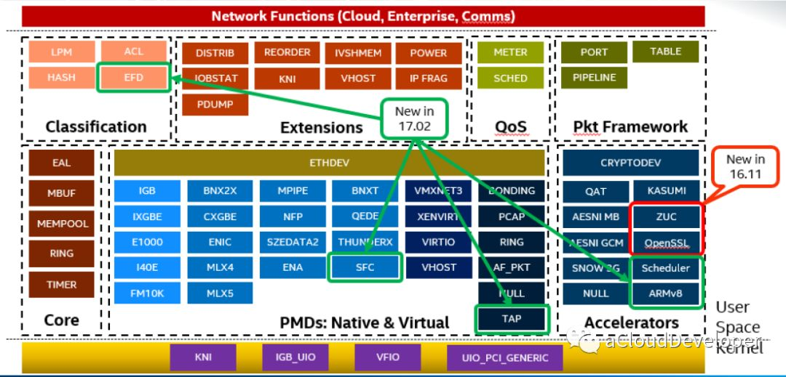
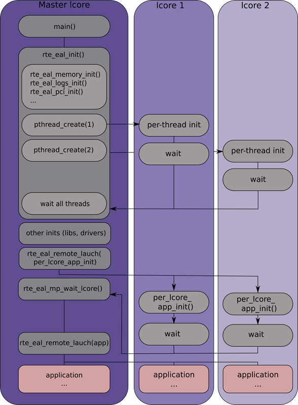

* content
{:toc}

## 关于CPU
- physical CPU      物理CPU
- logical CPU       逻辑CPU  超线程的每组寄存器、缓存与逻辑单元组成一个逻辑CPU
- virtual CPU       虚拟CPU  等同逻辑CPU
- core              核数     在同一片芯片上存在的物理CPU
- thread            线程数    也就是逻辑数
- socket            颗、槽    在主板上的不同CPU插槽
- HyperThreading    超线程    同时有两组寄存器、缓存但只有一组逻辑处理单元, 类似线程或进程切换,只是不需要上下文切换.

## 高性能网络技术
    随着云计算产业的异军突起，网络技术的不断创新，越来越多的网络设备基础架构逐步向基于通用处理器平台的架构方向融合，从传统的物理网络到虚拟网络，从扁平化的网络结构到基于SDN分层的网络结构，无不体现出这种创新与融合。
    这在使得网络变得更加可控制和成本更低的同时，也能够支持大规模用户或应用程序的性能需求，以及海量数据的处理。究其原因，其实是高性能网络编程技术随着网络架构的演进不断突破的一种必然结果。

## C10K 到 C10M 问题的演进
- C10K即单机一万并发连接问题: 使用的 I/O 多路复用模型select, poll, epoll解决。
- C10M即单机一千万个并发连接问题: OS内核是导致C10M问题的关键所在:
    - 中断处理: 当网络中大量数据包到来时，会产生频繁的硬件中断请求，这些硬件中断可以打断之前较低优先级的软中断或者系统调用的执行过程，如果这种打断频繁的话，将会产生较高的性能开销。通过 控制层和数据层分离:将数据包处理、内存管理、处理器调度等任务转移到用户空间去完成，而内核仅仅负责部分控制指令的处理。这样就不存在上述所说的系统中断、上下文切换、系统调用、系统调度等等问题。
    - 内存拷贝: 数据从网卡通过DMA等方式传到内核开辟的缓冲区,然后从内核空间拷贝到用户态空间,占到了数据包整个处理流程的57.1%
    - 上下文切换: 硬件中断和软中断会产生大量的上下文切换开销.使用多核编程技术代替多线程技术,并设置CPU的亲和性减少彼此之间调度切换,采用无锁技术解决资源竞争问题
    - 局部性失效: 一个数据包的处理可能跨多个CPU核心造成CPU缓存失效,如果是NUMA架构,更会造成跨NUMA访问内存,性能受到很大影响.针对NUMA系统，尽量使CPU核使用所在NUMA节点的内存,避免跨内存访问
    - 内存管理: 传统服务器内存页为4K,为了提高内存的访问速度,cache miss与CPU检索效率不可调和.使用大页内存代替普通的内存,减少cache-miss

## 目前解决方案
- 6wind
- Windriver
- Netmap
- [DPDK](http://git.dpdk.org/) 最终胜出, 其它已经淘汰

## [DPDK](git://dpdk.org/dpdk)
- Linux内核网络数据流程:
    硬件中断->取包分发至内核线程->软件中断->内核线程在协议栈中处理包->处理完毕通知用户层->用户层收包->网络层->逻辑层->业务层
- dpdk 网络数据流程:
    硬件中断->放弃中断流程->用户层通过设备映射取包->进入用户层协议栈->逻辑层->业务层
- UIO用户空间的I/O 技术
    通过UIO能够拦截中断,并重设中断回调行为,从而绕过内核协议栈后续的处理流程.其实现机制是对用户空间暴露文件接口,当注册一个UIO设备uioX,会出现文件/dev/uioX,对该文件的读写就是对设备内存的读写。除此之外,对设备的控制还可以通过/sys/class/uio下的各个文件的读写来完成
- VFIO 用户态虚拟文件I/O
    中断、IO、DMA都暴露给用户, 用户不需要写内核虚拟设备, 以组的形式提供一组设备

- 内存池技术 mmap 实现内存池, 将内核态驱动DMA设备内存与用户态内存共享
- 大页内存管理 实现了一组大页内存分配、使用和释放的API,同时也兼容普通的内存申请
- 无锁环形队列  基于Linux内核的无锁环形缓冲kfifo实现了一套无锁机制.支持单生产者入列/单消费者出列和多生产者入列/多消费者出列操作
- poll-mode 网卡驱动完全抛弃中断模式,基于轮询方式收包,避免了中断开销.
- NUMA 内存分配上通过proc提供的内存信息,使CPU核心尽量使用靠近其所在节点的内存,避免了跨NUMA节点远程访问内存的性能问题.
- CPU亲和性 将一个线程或多个线程绑定到一个或多个CPU上减少了线程间的频繁切换带来的开销,避免CPU缓存的局部失效性.
- 多核调度框架 基于多核架构:一般会有主从核之分,主核负责完成各个模块的初始化,从核负责具体的业务处理.

- 二层网络应用 交换机
    - [OVS](https://github.com/openvswitch/ovs)Open vSwitch是一个多核虚拟交换机平台，支持标准的管理接口和开放可扩展的可编程接口，支持第三方的控制接入.
    - [VPP](https://wiki.fd.io/view/VPP)cisco开源的一个高性能的包处理框架,提供了交换/路由功能,在虚拟化环境中,使它可以当做一个虚拟交换机来使用.性能要好于OVS+DPDK的组合，但它更适用于NFV,适合做特定功能的网络模块.
    - [Lagopus](https://github.com/lagopus/lagopus)多核虚拟交换的实现,功能和OVS差不多,支持多种网络协议,如Ethernet,VLAN,QinQ,MAC-in-MAC,MPLS和PBB,以及隧道协议如GRE,VxLan和GTP.
    - [Snabb](https://github.com/SnabbCo/snabbswitch)是一个简单且快速的数据包处理工具箱.
- 三层网络应用 虚拟路由器
    - [OPENCONTRAIL](http://www.opencontrail.org)集成了SDN控制器的虚拟路由器,用于OpenStack结合Neutron提供一站式的网络支持.
    - [CloudRouter](https://cloudrouter.org) 一个分布式的路由器
- 应用层
    - [mTCP](https://github.com/eunyoung14/mtcp) 是一个针对多核系统的高可扩展性的用户空间TCP/IP协议栈
    - [IwIP](http://git.savannah.gnu.org/cgit/lwip) 针对RAM平台的精简版的TCP/IP协议栈实现.
    - [Seastar](http://www.seastar-project.org) 基于C++11/14,支持高并发和低延迟的异步编程高性能库
    - [f-stack](https://github.com/f-stack/f-stack) 腾讯开源移植了FreeBSD协议栈,提供POSIX API,集成协程框架、Nginx、Redis
    - [dpvs](https://github.com/iqiyi/dpvs) 爱奇艺LVS
- 测试环境
    - 网卡:一块用于正常的网络, 两块开发 ethernet0.virtualDev = "e1000"|"vmxnet3" ethernet0.present = "TRUE" ethernet0.wakeOnPcktRcv = "true"
    - CPU 开启Intel VT-x/EPT 和 IOMMU && lscpu
    - vi /etc/sysconfig/modules/vfio_pci.modules #!/usr/bin/env bash /sbin/modprobe vfio_pci
    - vi /etc/default/grub GRUB_CMDLINE_LINUX_DEFAULT="xxx iommu=pt intel_iommu=on default_hugepagesz=1G hugepagesz=2M hugepages=1024 isolcpus=2-7"
    - sudo grub2-mkconfig -o /boot/grub2/grub.cfg && reboot && dmesg | grep -e IOMMU && cat /proc/cmdline
    - nmcli con show && lspci | grep Ethernet
    - yum -y install kernel-devel kernel-tools kernel-headers kernel-tools-libs-devel numactl numactl-devel
    - yum -y install gcc python3 ninja-build python3-pip && pip install meson ninja
- 基本使用
    ```shell
    mkdir build
    pushd dpdk
        meson configure ../build
    popd
    pushd build
        meson -Dexamples=all -Dbuildtype=debug
        ninja
        ninja install
    popd
    #meson arm64-build --prefix=/usr/local --cross-file arm.txt
    #ninja -C arm64-build
    #DESTDIR=/path/to/install ninja -C arm64-build install
    ```

- [内存模型](https://blog.csdn.net/majianting/article/details/104207201)
- 代码结构
    - kernel-kni 将用户态数据重新传回系统内核处理的内核驱动

## [SPDK](https://github.com/spdk/spdk) 存储加速


## ARM Vexpress Cortex-A9 开发板 驱动开发
- [linux](https://cdn.kernel.org/pub/linux/kernel/v4.x/linux-4.9.99.tar.xz)
- [systemd]()
- [busybox](https://busybox.net/downloads/busybox-1.33.1.tar.bz2)
- [SysVinit]()
- [crosstool](http://www.crosstool-ng.org)
- [gcc](http://www.mentor.com/embedded-software/sourcery-tools/sourcery-codebench/editions/lite-edition)
- [gcc](https://releases.linaro.org/components/toolchain/binaries/latest-7/arm-linux-gnueabi/)
``shell
    yum -y install epel-release.noarch ncurses-devel wget
    yum -y update
    reboot
    rpm -qa |grep kernel
    grub2-mkconfig -o /boot/grub2/grub.cfg
    grub2-set-default 0

    wget https://releases.linaro.org/components/toolchain/binaries/latest-7/arm-linux-gnueabi/gcc-linaro-7.5.0-2019.12-x86_64_arm-linux-gnueabi.tar.xz
    tar -xvf gcc-linaro-7.5.0-2019.12-x86_64_arm-linux-gnueabi.tar.xz
    mv gcc-linaro-7.5.0-2019.12-x86_64_arm-linux-gnueabi gcc

    wget https://releases.linaro.org/components/toolchain/binaries/latest-7/arm-linux-gnueabi/sysroot-glibc-linaro-2.25-2019.12-arm-linux-gnueabi.tar.xz
    tar -xvf sysroot-glibc-linaro-2.25-2019.12-arm-linux-gnueabi.tar.xz
    mv sysroot-glibc-linaro-2.25-2019.12-arm-linux-gnueabi sysroot
    
    wget https://cdn.kernel.org/pub/linux/kernel/v4.x/linux-4.9.99.tar.xz
    tar -xvf linux-4.9.99.tar.xz
    pushd linux-4.9.99
    make CROSS_COMPILE=xx/gcc/bin/arm-linux-gnueabi- ARCH=arm vexpress_defconfig
    make CROSS_COMPILE=xx/gcc/bin/arm-linux-gnueabi- ARCH=arm menuconfig
    #sysroot static prefix
    make CROSS_COMPILE=xx/gcc/bin/arm-linux-gnueabi- ARCH=arm -j8
    popd

    wget https://busybox.net/downloads/busybox-1.33.1.tar.bz2
    tar -xvf busybox-1.33.1.tar.bz2
    pushd busybox-1.33.1
    make CROSS_COMPILE=xx/gcc/bin/arm-linux-gnueabi- ARCH=arm defconfig
    make CROSS_COMPILE=xx/gcc/bin/arm-linux-gnueabi- ARCH=arm menuconfig
    make CROSS_COMPILE=xx/gcc/bin/arm-linux-gnueabi- ARCH=arm -j8
    popd

    dd if=/dev/zero of=vexpress.img bs=1M count=1024
    mkfs.ext3 vexpress.img
    mkdir -p /mnt/tmpfs
    mount -t ext3 vexpress.img /mnt/tmpfs -o loop
    mkdir -p /mnt/tmpfs/proc/
    mkdir -p /mnt/tmpfs/sys/
    mkdir -p /mnt/tmpfs/tmp/
    mkdir -p /mnt/tmpfs/root/
    mkdir -p /mnt/tmpfs/var/
    mkdir -p /mnt/tmpfs/mnt/
    mkdir -p /mnt/tmpfs/dev/
    cp -arf xx/busybox-xx/_install/* /mnt/tmpfs/
    cp -arf xx/gcc/lib /mnt/tmpfs/
    xx/gcc/bin/arm-linux-gnueabi-strip /mnt/tmpfs/lib/*
    mknod /mnt/tmpfs/dev/tty1 c 4 1
    mknod /mnt/tmpfs/dev/tty2 c 4 2
    mknod /mnt/tmpfs/dev/tty3 c 4 3
    mknod /mnt/tmpfs/dev/tty4 c 4 4
    mknod /mnt/tmpfs/dev/console c 5 1
    mknod /mnt/tmpfs/dev/null c 1 3
    umount /mnt/tmpfs
    rm -rf /mnt/tmpfs

    cp arch/arm/boot/zImage arch/arm/boot/dts/vexpress-v2p-ca9.dtb vexpress.img
    
    #mmcblk0p1 mmc卡 blk0块设备 p1第一分区
    qemu-system-arm -nographic -sd vexpress.img -M vexpress-a9 -m 512M -kernel zImage -dtb vexpress-v2p-ca9.dtb -smp 4 -append "init=/linuxrc root=/dev/mmcblk0 rw rootwait earlyprintk console=ttyAMA0"
``

## linux 内核模块
```C
#include <linux/init.h>
#include <linux/module.h>
//linux/vermagic.h -> UTS_RELEASE
module_init(static int __init (*init)(void));
module_exit(static void __exit (*exit)(void));
module_param(str, charp, S_IRUGO); //byte short ushort int uint long ulong bool invbool
module_param_array(ids, uint, 16, S_IRUGO);
EXPORT_SYMBOL(func_global);
EXPORT_SYMBOL_GPL(func_global);
MODULE_AUTHOR("nomadli dzym79@qq.com");
MODULE_LICENSE("GPL");
MODULE_DESCRIPTION("linux kernel module description");
MODULE_ALIAS("module_alias_name");
MODULE_VERSION("1.0.0");
MODULE_DEVICE_TABLE(struct usb_device_id[]);
```
```makefile
KVERS = $(shell uname -r)
obj-m += xx.o
xx-objs := a.o b.o
EXTRA_CFLAGS=-g -O0
build: kernel_modules
kernel_modules:
	make -C /lib/modules/$(KVERS)/build M=$(CURDIR) modules

clean:
	make -C /lib/modules/$(KVERS)/build M=$(CURDIR) clean

```
```shell
insmod xxx.ko parmname=aaa paramarry=b,c,d 直接加载任意位置模块
rmmod xxx  卸载模块
lsmod 列出已加载模块
ls /sys/module
modprobe -r xxx
depmod #/lib/modules/kernel-version/modules.dep
modinfo xxx
#/proc/kallsyms
dmesg 显示当前内存中的内核信息及日志
```