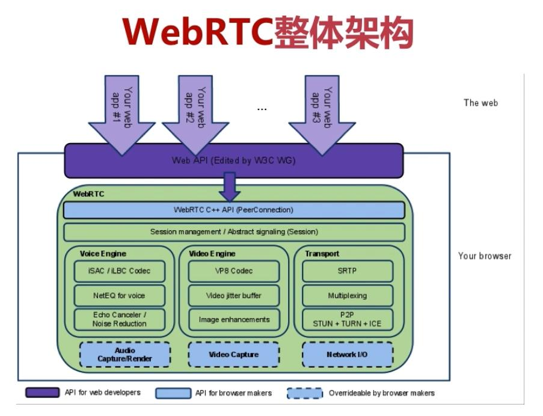
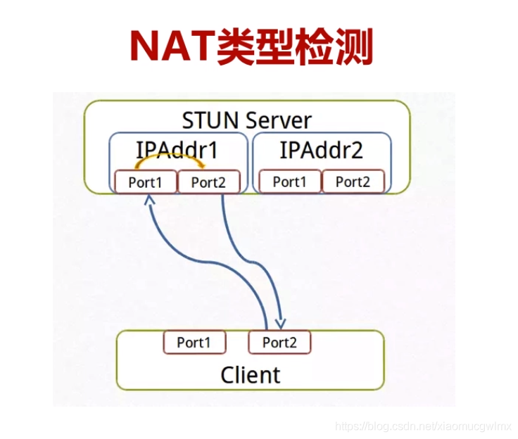

* content
{:toc}

## [总览](https://developer.mozilla.org/zh-CN/docs/Web/API/WebRTC_API)

- 应用层: 紫色部分是Web开发者API层
- API层: WebRTC Native C++ API,面向浏览器厂商的API层
- Session: 传输/会话层，也就是上下文管理层，管理音视频。非音视频等数据处理逻辑
- VoiceEngine: 音频引擎包括从视频采集卡到网络传输端等整个解决方案
    - iSAC Internet Speech Audio Codec 默认 16khz(默认),24khz,32khz,10kbit/s~52kbit/s
    - iLBC Internet Low Bitrate Codec  VoIP 8khz 由IETF RFC3951和RFC3952定义
    - NetEQ for Voice 自适应抖动控制算法以及语音包丢失隐藏算法,与AEC\NR\AGC等集成效果更好
    - AEC Acoustic Echo Canceler 回声消除器是一个基于软件的信号处理元件
    - NR Noise Reduction 消除背景噪声
- VideoEngine 视频框架从摄像头采集视频到视频信息网络传输再到视频显示,H264、openH264等
    - VP8 默认,针对低延时设计
    - Video Jitter Buffer 视频抖动缓冲器,可以降低由于视频抖动和视频信息包丢失带来的不良影响
    - Image enhancements 图像质量增强模块,包括明暗度检测、颜色增强、降噪处理等，用来提升视频质量。
- Transport RTP/SRTP、RTCP，Multiplexing over UDP 通道复用
- 系统硬件相关
    - Audio Capture/Render 音频的采集与渲染
    - Video Capture 视频采集，这里没有视频的渲染
    - Network I/O 网络I/O

## [源码目录](https://gitlab.com/webrtcmirrors/webrtc.git)
- api                           浏览器接口
- call                          数据流管理
- video                         视频框架
- audio                         音频框架
- common_audio                  音频算法
- common_video                  视频算法
- media                         编码算法等
- logging                       日志
- module                        子模块
    - audio_coding              音频编解码
    - audio_device              音频采集播放
    - audio_mixer               混音
    - audio_processiong         音频处理
    - bitrate_controller        码率控制
    - congestion_controller     流控
    - desktop_capture           桌面采集
    - pacing                    码率探测及平滑处理
    - remote_bitrate_estimator  远端码率估算
    - rtp_rtcp                  rtp/rtcp协议
    - video_capture             视频采集
    - video_coding              视频编解码
    - video_processiong         视频处理
- pc                            peer connection
- p2p                           stun turn 相关
- rtc_base                      线程、锁等
- rtc_tool                      音视频分析工具
- tool_webrtc                   测试相关
- system_wrappers               与系统硬件相关
- stats                         数据统计相关
- sdk                           android、ios等

## NAT 判断

```flow
    启动=>start: send to same addr:port
    联通1=>condition: Received?
    BUDP=>end: UDP Blocked
    Public1=>condition: Public IP == Local IP？
    NONAT=>operation: No NAT
    SED2=>operation: send to diff addr:port2
    联通2=>condition: Received?
    SFireWall=>end: Symmetric FireWall
    OIP=>end: Open Internet

    Check=>operation: NAT detected
    OUTIPP=>operation: send to diff addr:port2
    联通3=>condition: Received?
    FCNAT=>end: Full Core NAT

    Check2=>operation: send to same addr:port
    SAMEIP=>condition: same Public IP first
    SNAT=>end: Symmetric NAT
    OUTIPP2=>operation: send to diff addr:port3
    联通4=>condition: Received?
    RPNAT=>end: Restricted port NAT
    RCNAT=>end: Restricted cone NAT
    
    启动->联通1
    联通1(no)->BUDP
    联通1(yes)->Public1
        Public1(yes)->NONAT->SED2->联通2
            联通2(no)->SFireWall
            联通2(yes)->OIP
        Public1(no)->Check->OUTIPP->联通3
            联通3(yes)->FCNAT
            联通3(no)->Check2->SAMEIP
                SAMEIP(no)->SNAT
                SAMEIP(yes)->OUTIPP2->联通4
                    联通4(NO)->RPNAT
                    联通4(YES)->RCNAT
```

## ICE
- SDP 信息描述 key=value
    - key必须UTF-8的子集US-ASCII value可以ISO 10646, key不可扩展, [RFC4566](https://link.zhihu.com/?target=http%3A//www.rfc-editor.org/info/rfc4566)
    - key必须以固定顺序给出
        - v= (protocol version)                        必须
        - o= (originator and session identifier)       必须
        - s= (session name)                            必须
        - i= (session information)
        - u= (URI of description)
        - e= (email address)
        - p= (phone number)
        - c= (connection information -- not required if included in all media)
        - b= (zero or more bandwidth information lines)
        - t= (time the session is active)               必须
        - r= (zero or more repeat times)
        - z= (time zone adjustments)
        - k= (encryption key)
        - a= (zero or more session attribute lines)
        - 可选的媒体节
            - m= (media name and transport address)     必须
            - i= (media title)
            - c= (connection information -- optional if included at session level)
            - b= (zero or more bandwidth information lines)
            - k= (encryption key)
            - a= (zero or more media attribute lines)
- Offer/Answer模型 基于SDP实现互相操作 [RFC3264](https://link.zhihu.com/?target=http%3A//www.rfc-editor.org/info/rfc3264)