* content
{:toc}

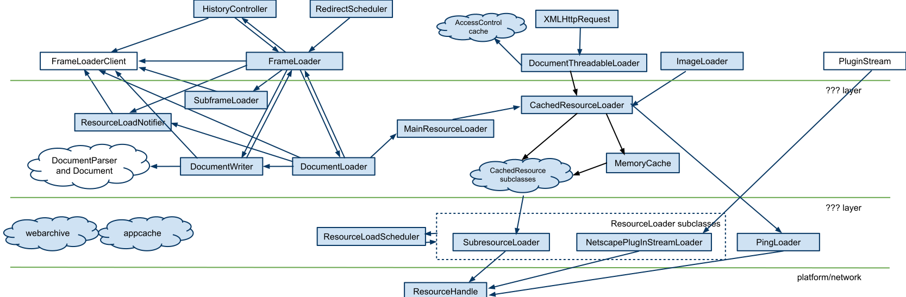

## Page
- Page对应一个页面请求,前进后退、导航、编辑、右键菜单、设置、Inspector等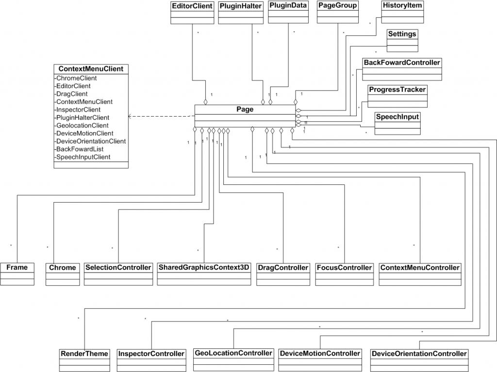
- PageGroup 有共同的属性、设置的Page编成组方便管理,包括localStorage属性、IndexDB、User Script、User StyleSheet等,User Script和User StyleSheet一般在网页解析完毕后插入到Document中。新的Page对象通过addPage加入m_pages.有导航发生时调用addVisitedLink将url加入已访问链接中。要跟踪已访问的接口，则在初始化的时候必须调用PageGroup::setShouldTrackVisitedLinks，且参数为true。此处shouldTrackVisitedLinks是静态的全局变量
调用InitGroup如果没有设置GroupName，则生成一个空GroupName的PageGroup，由m_singlePageGroup维护,调用setGroupName重新创建PageGroup由m_group来维护。
- Setting
- Chrome 原生窗口接口类,继承并传入对象后,实现刷新、滚动等
- SelectionController:Frame的Selection返回空时候,处理select
- SharedGraphicsContext3D:共享3D图形上下文提供了createDrawingBuffer来创建DrawingBuffer。
- DragController:拖拽控制器
- FocusController:焦点控制器
- ContextMenuController:右键下拉菜单控制器。
- InspectorController:Inspector控制器
- GeolocationController:定位定位服务控制器。
- DeviceMotionController:设备移动控制器
- DeviceOrientationController:设备方向控制器
- SpeechInputClient:语音输入Client
- ProgressTracker:进度跟踪。
- BackForwardController:前进后退操作控制。
- Frame:一个Page至少一个主帧和若干个其它子帧构成。
- HistoryItem:历史记录。
- PluginData:插件相关，未来可能同PluginDatabase类合并。主要是初始化Plugin的信息。
- PluginHalter:用来控制Plugin的停止和重新开始。
- RenderTheme:这个类提供了控件的渲染和绘制接口
- EditorClient:同编辑功能相关，比如拷贝、剪切、删除等操作。

## Frame
- Frame对应于Page里面的帧, 标记语言解析、排版、加载 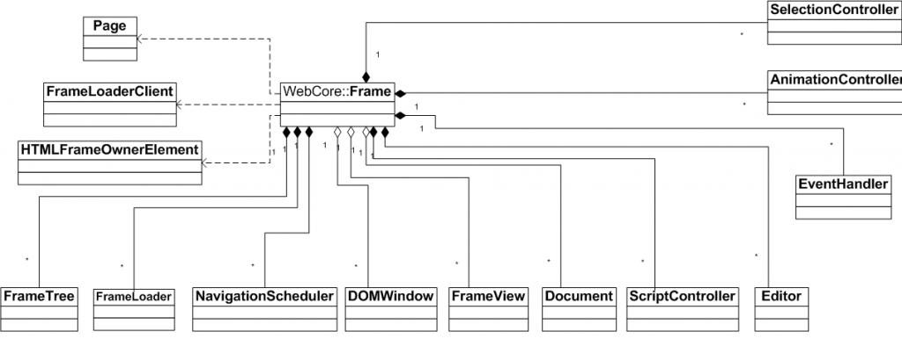
- FrameTree对象用来协助管理父帧和子帧的关系，常见的比如main frame之中有iframe元素，就会调用FrameLoaderClientQt::createFrame来产生子帧，产生的子帧会通过appendChild添加到主帧的树状结构中。Frame通过FrameTree对象，可以方便地访问它的父帧，子帧，兄弟帧。
- FrameLoader对象用来完成frame的加载
- NavigationScheduler对象用来管理页面跳转调度（比如重定向，meta refresh等）。
- DOMWindow用来管理同DOM相关的事件、属性和消息。
- FrameViwe类用于Frame的排版。
- Document类用来管理这些dom节点,不同文档类型继承它,如HTML:HTMLDocument,XML:XMLDocument
- SciptController对象，脚本控制器，用来管理脚本的执行和操作。
- Editor对象用来处理页面的编辑相关的操作，比如拷贝，粘贴，输入等，Editor对象，它同Page类的EditorClient对象紧密合作。和EditorClient的关系就如同Page同Frame的关系。
- SelectionController用来管理Frame中的选取操作。
- AnimationControlle,动画控制，控制动画的播放，暂停，继续（同HTML video标签是否有关系？）
- EventHandler，事件处理对象，这里的对象主要是同上层应用也就是用户参与的事件，比如鼠标事件，按键事件（快捷键等），滚动事件，resize事件等。

## FrameLoader
- FrameLoader通过DocumentLoader加载Frame的内容 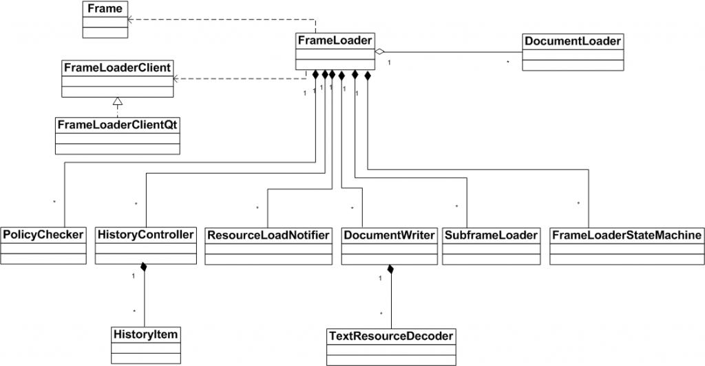
- Frame和FrameLoader是contain-a的关系，在Frame的构造函数中调用FrameLoader的构造函数，调用时传入参数Frame指针和FrameLoaderClient指针。
- Frame有可能有子Frame，所以维护SubFrameLoader对象m_subframeLoader来管理子Frame的load。Frame可以对应xml document，也可对应html document，等等。跟Document相关的子resource的load不在FrameLoader的职责范围内。
- DocumentWriter对象m_writer，当Frame的数据load finish的时候，将数据传给DocumentWriter类，进行下一步的处理（比如解码）
- FrameLoader维护了三个DocumentLoader实例，分别对应于不同的阶段，m_policyDocumentLoader对应于收到用户load调用，进行policy check阶段，m_provisionalDocumentLoader对应于policy check通过以后，Frame数据还没有到来之前，它会负责startLoadingMainResource的调用。m_documentLoader则是Frame第一个数据到来以后使用的DocumentLoader，这个时候，前一个主Frame的DocumentLoader已经不能再用(开始白屏，刷掉前一个页面的显示)。
- HistoryController，用于操作历史记录相关的接口，保存或者恢复Document和View相关的状态，维护前进后退队列，本质上是Page对象的关联，FrameLoader通过HistoryController操作m_backFowardController
- ResourceLoadNotifier，ResourceLoader事件通知
- SubframeLoader对象，处理子帧请求
- FrameState Document的下载状态: 发起(Provisional)、收到部分数据(CommittedPage)、完成,即http状态
- FramLoaderStateMachine DocumentLoader节点状态:已创建、显示状态
- PolicyChecker 对FrameLoader进行校验:需要新tab或窗口(NewWindow)、Navigation(请求发起)、收到数据(Content)判断Mime type等, FrameLoaderClient对请求进行校验，以确定是否允许继续，或者需要其它的动作。

## ResourceLoader
- Loader 通过Network完成网络、本地文件、缓存的请求 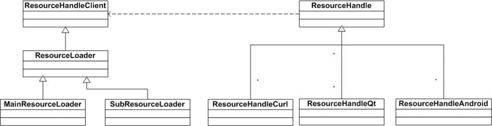
- Loader 把要加载的资源分成两类，一类是主资源，比如HTML页面或下载项，一类是派生资源如内嵌图片或脚本,主资源需要向用户报错,派生资源不向用户报错.因此分为MainResourceLoader、SubresourceLoader公共基类ResourceLoader
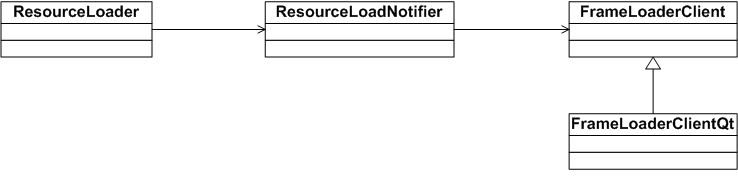
- 主资源立刻发起,派生资源在队列中等待,host影响资源加载的先后顺序,主资源没有缓存,派生资源有缓存
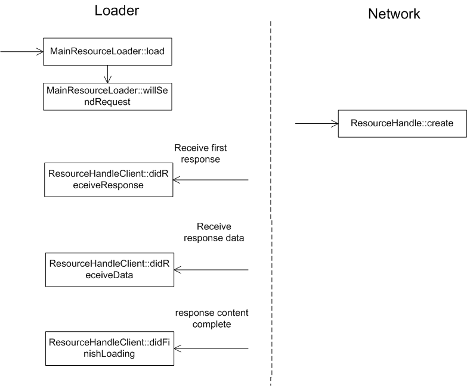
- DocumentLoader调用MainResourceLoader::load发起请求
- MainResourceLoader::loadNow
- MainResourceLoader::willSendRequest,通过ResourceNotifier调用FrameLoaderClient设置ResourceRequest
- PolicyChecker::checkNavigationPolicy 过滤掉重复请求等
- ResourceHandle::create 向Network发起加载请求
- 收到第一个HTTP响应数据包,Network回调MainResourceLoader::didReceiveResponse主要处理HTTP头部。
- PolicyChecker::checkContentPolicy通过FrameLoaderClient::dispatchDecidePolicyForMIMEType判断是否为下载请求（存在 "Content-Disposition"http 头部）
- MainResourceLoader::continueAfterContentPolicy，根据ResourceResponse检测是否发生错误。
- ResourceLoader::didReceiveResponse通过ResourceNotifier通知FrameLoaderClient
- 收到HTTP body调用MainResourceLoader::didReceiveData通过ResourceNotifier通知FrameLoaderClient
- MainResourceLoader::addData
- DocumentLoader::receivedData
- DocumentLoader::commitLoad
- FrameLoader::commitProvisionalLoad状态从provisional变为Committed
- FrameLoaderClientQt::committedLoad
- DocumentLoader::commitData启动Writer对象来处理数据DocumentWriter::setEncoding
- DocumentWriter::addData
- DocumentParser::appendByte
- DecodedDataDocumentParser::appendBytes 对文本编码进行解码
- HTMLDocumentParser::append ，进行 HTML 解析
- MainResourceLoader::didFinishLoading
- FrameLoader::finishedLoading
- DocumentLoader::finishedLoading
- FrameLoader::finishedLoadingDocument启动writer对象接收剩余数据循环进行解析
- DocumentWriter::end结束接收数据 调用Document::finishParsing
- HTMLDocumentParser::finish
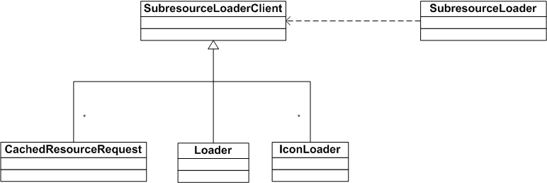
- 派生资源加载SubresourceLoader通过SubresourceLoaderClient进行网络操作,派生类对不同资源进行操作
- cache用来缓存资源
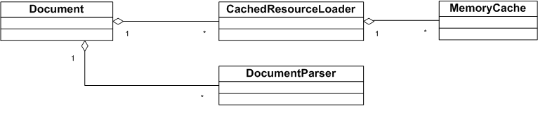
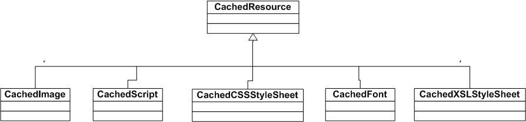
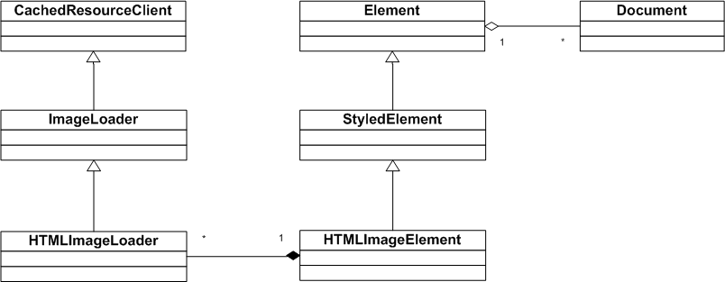
- image加载过程
    - 解析html的img标签调用HTMLImageElement::create创建HTMLImageElement对象包含HTMLImageLoader
    - 解析img的href属性调用ImageLoader::updateFromElementIgnoringPreviousError
    - ImageLoader::updateFromElement
    - CachedResourceLoader::requestImage
    - CachedResourceLoader::requestResource(判断从缓存获取或从网络获取)
    - CachedResourceLoader::loadResource
    - 根据Resource的类型调用createResource创建对应的CachedResource
    - MemoryCache::add在cache中查找是否有对应的cache条目如果没有创建
    - CachedImage::load
    - CachedResource::load
    - CachedResourceLoader::load
    - CachedResourceRequest::load
    - CachedResourceRequest通过SubresourceLoader操作数据
    - ResourceLoaderScheduler::scheduleSubresourceLoad
    - SubresourceLoader::create
    - ResourceLoadScheduler::requestTimerFired
    - ResourceLoader::start
    - ResourceHandle::create 发起请求
    - 收到HTTP响应头调用ResourceLoader::didReceiveResponse
    - SubresourceLoader::didiReceiveResponse
    - CachedResourceRequest::didReceiveResponse处理响应头部,解析缓存相关头部
    - ResourceLoader::didReceiveResponse
    - 收到body数据调用ResourceLoader::didReceiveData
    - SubresourceLoader::didReceiveData
    - ResourceLoader::didReceiveData
    - ResourceLoader::addData存储到SharedBuffer
    - CachedResourceRequest::didReceiveData
    - 数据获取完成调用ResourceLoader::didFinishLoading
    - SubresourceLoader::didFinishLoading
    - CachedResourceRequest::didFinishLoading
    - CachedResource::finish
    - CachedResourceLoader::loadDone
    - CachedImage::data创建对应的Image对象解码

## html解析过程
- 词法分析 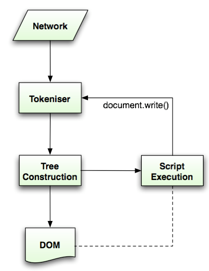
- Dome树 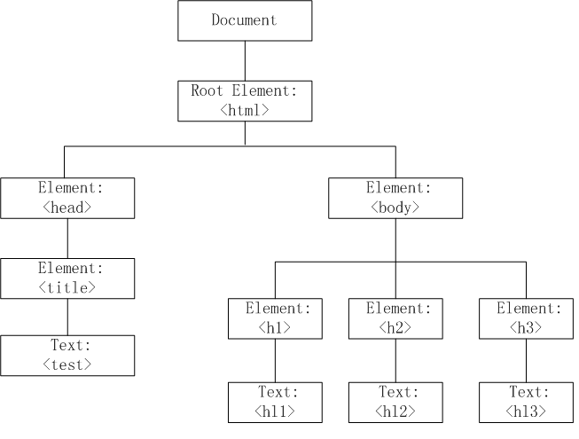
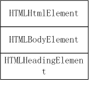


```C++
//web app call stack
Page::Page
    for (; ;) {
        static PassRefPtr<Frame> Frame::create(Page*,HTMLFrameOwnerElement*,FrameLoaderClient*);
        FrameLoader::finishedLoading
        HTMLDocumentParser::append
        HTMLTreeBuilder::processToken
        HTMLElementBase::openURL
        if (1) {
            SubFrameLoader::requestFrame
            //web app call stack
        } else {
            break;
        }
    }
FrameLoader::commitProvisionalLoad
FrameLoader::transitionToCommitted
//web app call stack
void Frame::createView(const IntSize&, const Color&, bool, const IntSize&, bool,ScrollbarMode = ScrollbarAuto, bool horizontalLock = false,ScrollbarMode = ScrollbarAuto, bool verticalLock = false)
Frame::setView
//web app call stack
Frame::init
FrameLoader::init
DocumentWriter::begin
Frame::setDocument
ResourceLoader::didReceiveData
MainResourceLoader::addData
DocumentLoader::receivedData
DocumentLoader::commitLoad
//web app call stack
DocumentLoader::commitIfReady
DocumentLoader::commitProvisionalLoad
DocumentLoader::commitData
DocumentWriter::setEncoding
DocumentWriter::willSetEncoding
FrameLoader::receivedFirstData
DocumentWriter::begin
FrameLoader::clear
Frame::setDocument
DocumentWritter::end
//web app call stack
Document::finishParsing
Document::finishedParsing
FrameLoader::finishedParsing
FrameLoader::load(const ResourceRequest& request,bool lockHistory)
```
