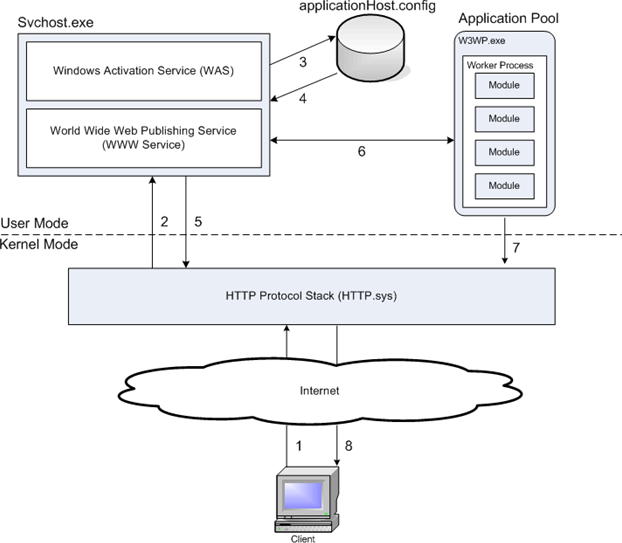
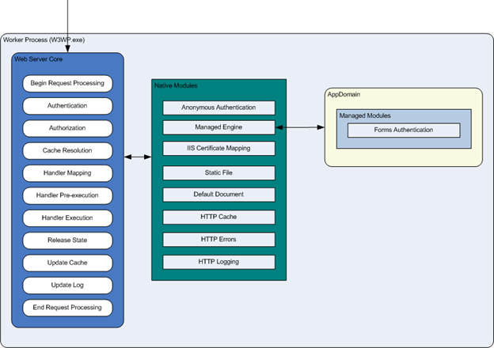

* content
{:toc}

## 缓存
- Pragma > Cache-Control > Expires > Last-Modified > ETag
- Pragma:no-cache 响应Expires过期时间相对于服务器时间
- Cache-Control
    - no-cache	不直接使用缓存，直接向原服务器发起请求
    - no-store	所有内容都不会保存到缓存或 internet 临时文件中
    - max-age=delta-seconds	接收一个存在时间不大于delta-seconds秒的资源
    - max-stale[=delta-seconds]	接收一个超过缓存时间的资源，若有定义 delta-seconds 则为 delta-seconds 秒，若没有则为任意超出时间
    - min-fresh=delta-seconds接收一个在小于delta-seconds秒内被更新过的资源
    - no-transform 获取实体数据没有被转换（如压缩）过的资源
    - only-if-cached 获取缓存的内容（若有），而不用向原服务器发去请求
    - cache-extension 自定义扩展值，若服务器不识别该值将被忽略
- Cache-Control 响应
    - Public 指示响应可被任何缓存区缓存
    - Private[="field-name"] 报文中全部或部分仅开放给某些用户做缓存使用，其他用户不能缓存这些数据
    - no-cache	不直接使用缓存，要求向服务器发起（新鲜度校验）请求
    - no-store	所有内容都不会被保存到缓存或 internet 临时文件中
    - no-transform	告知服务器缓存文件时不得对实体数据做任何改变
    - only-if-cached 服务器希望客户端获取缓存的内容（若有），而不用向原服务器发去请求
    - must-revalidate 当前资源一定是向原服务器发去验证请求的，若请求失败会返回 504（而非代理服务器上的缓存）
    - proxy-revalidate	与 must-revalidate 类似，但仅能应用于共享缓存（如代理）
    - max-age=delta-seconds	该资源在 delta-seconds 秒内是新鲜的，无需向服务器发请求
    - maxage=delta-seconds	同 max-age，但仅应用于共享缓存（如代理）
    - cache-extension	自定义扩展值，若服务器不识别该值将被忽略掉
    - max-age=delta-seconds	告知客户端存在时间（age）不大于 delta-seconds 秒的资源
    - max-stale[=delta-seconds]	告知服务器客户端愿意接收一个超过缓存时间的资源，若有定义 delta-seconds 则为 delta-seconds 秒，若没有则为任意超出时间
    - min-fresh=delta-seconds	告知服务器客户端希望接收一个在小于 delta-seconds 秒内被更新过的资源
    - no-transform	告知服务器客户端希望获取实体数据没有被转换（如压缩）过的资源
    - only-if-cached	告知服务器客户端希望获取缓存的内容（若有），而不用向服务器发去请求
    - cache-extension	自定义扩展值，若服务器不识别该值将被忽略
- Last-Modified、If-Modified-Since 配合 200或304 (date_value - last_modified_value) * 0.1
- ETag、If-None-Match 配合 200或304

## sitemap网站地图
- 支持html、xml、txt
- 一个sitemap文件不能超过50000个链接
- robots.txt 可以指定 Sitemap: https://www.eastmoney.com/sitemap.xml
- 领动网站->登录网站后台->编辑网站->SEO->提交搜索引擎收录->百度->SiteMap->提交至百度
```xml
<?xml version="1.0" encoding="UTF-8"?>
<urlset xmlns="http://www.sitemaps.org/schemas/sitemap/0.9"
        xmlns:news="http://www.google.com/schemas/sitemap-news/0.9">
    <url>
        <loc>https://www.eastmoney.com</loc>
        <lastmod>2009-11-08t04:20-08:00</lastmod><!--上次更新时间-->
        <changefreq>always</changefreq><!--更新频率hourly|daily|weekly|monthly|yearly|never-->
        <priority>1.0</priority><!--优先级0.0-1.0-->
    </url>
    <url>
        <loc>https://www.eastmoney.com/post/*HTML</loc>
        <lastmod>2009-11-08t20:20:36z</lastmod>
        <chanefreq>daily</chanefreq>
        <priority>0.8</priority>
    </url>
    <url>
        <loc>http://www.example.org/business/article55.html</loc>
        <news:news>
            <news:publication>
                <news:name>The Example Times</news:name>
                <news:language>en</news:language><!--zh-cn-->
            </news:publication>
            <news:publication_date>2008-12-23</news:publication_date>
            <news:title>Companies A, B in Merger Talks</news:title>
        </news:news>
  </url>
</urlset>
```

## vue
```shell
npm install -g vue @vue/server-renderer @vue/cli
npm -g audit fix --force
vue -V
vue init webpack-simple vuego
npm install
#npm install vue-server-renderer vue-router express webpack-merge --save
npm i -D vue-server-renderer
touch src/entry-client.js
touch src/entry-server.js
touch build/webpack.server.conf.js
```

## IIS
- 
- 
- http.sys处于内核实现http拦截、解析、预处理、缓存、队列、安全等
- W3SVC == www service 监听配置修改更新http.sys,监听htt.sys队列启动或通知WAS
- WAS == Windows Process Activation Service 管理应用程序池及工作进程,读取ApplicationHost.config配置W3SVC或其他监听适配器,读取全局配置信息、协议配置信息(包括HTTP和Non-HTTP协议)、应用程序池配置(如进程账户信息)、网站配置(如绑定于程序)、应用程序配置(如可用的协议与程序所属的应用程序池)
- 如果不提供http服务可以不启动W3SVC监听适配器,可以自定义监听适配器如WCF(NetTcpActivator)
- WAS管理HTTP和Non-HTTP的应用程序池和工作进程。当应用程序池接收到客户端请求，WAS检测是否有正在运行的工作进程，如果应用程序池有工作进程可以处理请求，监听器就把该请求传递给工作进程来处理，否则，WAS将创建一个新的工作进程。
- 应用程序池有：经典模式、集成模式
- HTTP模块 CustomErrorModule、ttpRedirectionModule、ProtocolSupportModule、RequestFilteringModule、WebDAVModule
- 安全模块 AnonymousAuthenticationModule、BasicAuthenticationModule、CertificateMappingAuthenticationModule、DigestAuthenticationModule、IISCertificateMappingAuthenticationModule、RequestFilteringModule、UrlAuthorizationModule、WindowsAuthenticationModule、IpRestrictionModule
- 内容模块 CgiModule、DefaultDocumentModule、DirectoryListingModule、IsapiModule、IsapiFilterModule、ServerSideIncludeModule、StaticFileModule、FastCgiModule
- 压缩模块DynamicCompressionModule、StaticCompressionModule
- 缓存模块 FileCacheModule、HTTPCacheModule、TokenCacheModule、UriCacheModule
- 日志及诊断模块 CustomLoggingModule、FailedRequestsTracingModule、HttpLoggingModule、RequestMonitorModule、TracingModule
- 托管支持模块 ManagedEngine、ConfigurationValidationModule
- 托管模块 AnonymousIdentification、DefaultAuthentication、FileAuthorization、FormsAuthentication、OutputCache、Profile、RoleManager、Session、rlAuthorization、UrlMappingsModule、WindowsAuthentication
