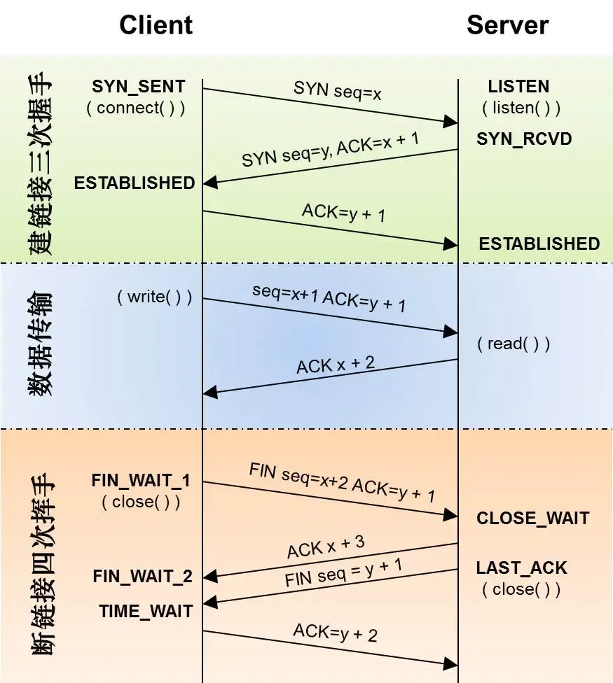

* content
{:toc}

## TCP



- 由于有半链接和全链接内核队列, 因此关掉listen重新listen会丢掉这部分用户链接, 因此需要新进程继承listen
```go
package main

import (
    "context"
    "flag"
    "fmt"
    "net"
    "net/http"
    "os"
    "os/exec"
    "os/signal"
    "syscall"
)

var (
    upgrade bool
    ln      net.Listener
    server  *http.Server
)

func hello(w http.ResponseWriter, r *http.Request) {
    fmt.Fprintf(w, "hello world from pid:%d, ppid: %d\n",
        os.Getpid(), os.Getppid())
}

func main() {
    flag.BoolVar(&upgrade, "upgrade", false, "user can't use this")
    flag.Parse()
    http.HandleFunc("/", hello)
    server = &http.Server{Addr: ":8999"}
    var err error
    if upgrade { // 如果是平滑重启，会在fork时添加-upgrade的命令行参数
        // 继承的fd时从3开始的，（0,1,2分别备stdin,stdout,stderr占据了）
        fd := os.NewFile(3, "")
        // 平滑重启时，直接通过fd=3来继承套接字, 通过fd构造net.Listener时
        //，会将原理fd dup一份，因而下面要手动close以释放资源
        ln, err = net.FileListener(fd)
        if err != nil {
            fmt.Printf("fileListener fail, error: %s\n", err)
            os.Exit(1)
        }
        fd.Close() // 释放fd 3
    } else { // else分支对应服务首次启动，需要主动listen
        ln, err = net.Listen("tcp", server.Addr)
        if err != nil {
            fmt.Printf("listen %s fail, error: %s\n", server.Addr, err)
            os.Exit(1)
        }
    }
    go func() {
        err := server.Serve(ln)
        if err != nil && err != http.ErrServerClosed {
            fmt.Printf("serve error: %s\n", err)
        }
    }()
    setupSignal()
    fmt.Println("over")
}

func setupSignal() {
    ch := make(chan os.Signal, 1)
    signal.Notify(ch, syscall.SIGUSR2, syscall.SIGINT, syscall.SIGTERM)
    sig := <-ch
    switch sig {
    case syscall.SIGUSR2: // 通过给服务发送USR2信号触发平滑重启
        fmt.Println("SIGUSR2 received")
        err := forkProcess()
        if err != nil {
            fmt.Printf("fork process error: %s\n", err)
        }

        // 调用go标准库里的优雅重启方法，方法中会停止accept新连接，
        // 处理完历史连接后就退出
        err = server.Shutdown(context.Background())
        if err != nil {
            fmt.Printf("shutdown after forking process error: %s\n", err)
        }

    case syscall.SIGINT, syscall.SIGTERM: // 这两个信号只触发优雅退出
        signal.Stop(ch)
        close(ch)
        err := server.Shutdown(context.Background())
        if err != nil {
            fmt.Printf("shutdown error: %s\n", err)
        }
    }
}

func forkProcess() error {
    flags := []string{"-upgrade"} // 添加命令行参数，告知子进程继承fd而不要重新监听
    fmt.Printf("forkProcess - arg: %v", os.Args[0])
    // 将fork+exec两个系统后调用封装到了一起，os.Args[0]就是服务的binary
    // 所在路径，如果升级服务，平滑重启前需要覆盖服务的binary！！！
    cmd := exec.Command(os.Args[0], flags...)
    cmd.Stderr = os.Stderr
    cmd.Stdout = os.Stdout
    l, _ := ln.(*net.TCPListener)
    lfd, err := l.File()
    if err != nil {
        return err
    }
    // ExtraFiles填入继承的fd，GO标准库会保证继承的
    // fd时从3开始（0,1,2分别备stdin,stdout,stderr占据了）
    cmd.ExtraFiles = []*os.File{lfd}
    return cmd.Start()
}
```
