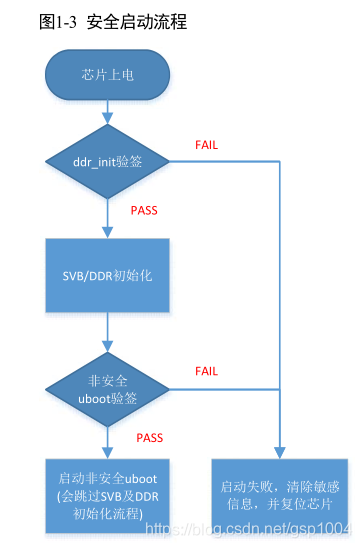
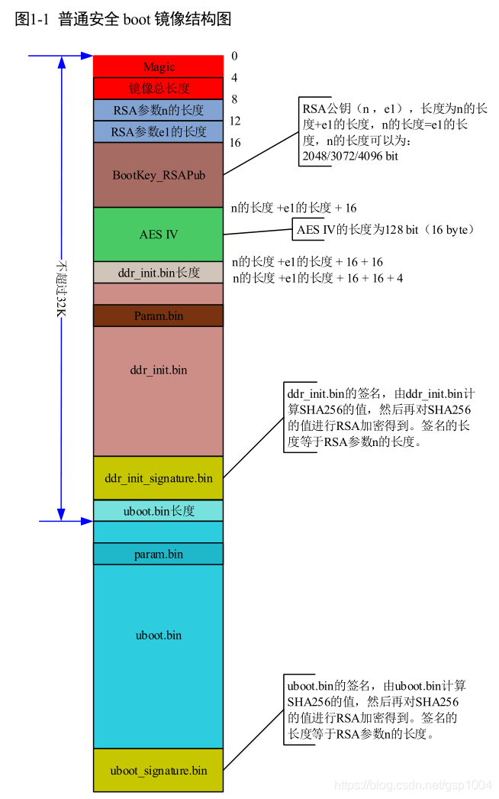

* content
{:toc}

## CH340芯片
- 主要作用是代替FT232、PL2303等芯片做USB转串口通信, 并价格便宜
- 内置USB转串口、自动检测串口通信参数、自动识别串口的波特率、校验位。
- 支持RS232、RS485、TTL等，支持8位数据位、1位停止位、无校验位等
- 内置了USB上拉电阻，UD+和UD-引脚应该直接连接到USB总线上。
- 内置了电源上电复位电路。
- 正常工作时需要外部向XI引脚提供12MHz的时钟信号。一般情况下，时钟信号由CH340内置的反相器通过晶体稳频振荡产生。外围电路只需要在XI和XO引脚之间连接一个12MHz的晶体，并且分别为XI和XO引脚对地连接振荡电容。
- 支持5V电源电压或者3.3V电源电压。当使用5V工作电压时，CH340芯片的VCC引脚输入外部5V电源，并且V3引脚应该外接容量为4700pF或者0.01uF的电源退耦电容。当使用3.3V工作电压时，CH340芯片的V3引脚应该与VCC引脚相连接，同时输入外部的3.3V电源，并且与CH340芯片相连接的其它电路的工作电压不能超过3.3V。
- 自动支持USB设备挂起以节约功耗，NOS#引脚为低电平时将禁止USB设备挂起。异步串口方式下CH340芯片的引脚包括：数据传输引脚、MODEM联络信号引脚、辅助引脚。数据传输引脚包括：TXD引脚和RXD引脚。串口输入空闲时，RXD应该为高电平，如果R232引脚为高电平启用辅助RS232功能，那么RXD引脚内部自动插入一个反相器，默认为低电平。串口输出空闲时，CH340T芯片的TXD为高电平，CH340R芯片的TXD为低电平。
- MODEM联络信号引脚包括：CTS#引脚、DSR#引脚、RI#引脚、DCD#引脚、DTR#引脚、RTS#引脚。所有这些MODEM联络信号都是由计算机应用程序控制并定义其用途。
- 辅助引脚包括：IR#引脚、R232引脚、CKO引脚、ACT#引脚。IR#引脚为低电平将启用红外线串口模式。R232引脚用于控制辅助RS232功能，R232为高电平时RXD引脚输入自动反相。ACT#引脚为USB设备配置完成状态输出（例如USB红外适配器就绪）。IR#和R232引脚只在上电复位后检查一次。
- 内置了独立的收发缓冲区，支持单工、半双工或者全双工异步串行通讯。串行数据包括1个低电平起始位、5、6、7或8个数据位、1个或2个高电平停止位，支持奇校验/偶校验/标志校验/空白校验。CH340支持常用通讯波特率：50、75、100、110、134.5、150、300、600、900、1200、1800、2400、3600、4800、9600、14400、19200、28800、33600、38400、56000、57600、76800、115200、128000、153600、230400、460800、921600、1500000、2000000等。串口发送信号的波特率误差小于0.3％，串口接收信号的允许波特率误差不小于2％。
- 在计算机端的Windows操作系统下，CH340的驱动程序能够仿真标准串口，所以绝大部分原串口应用程序完全兼容，通常不需要作任何修改。
- 可以用于升级原串口外围设备，或者通过USB总线为计算机增加额外串口。通过外加电平转换器件，可以进一步提供RS232、RS485、RS422等接口。
- 只需外加红外线收发器，就可以通过USB总线为计算机增加SIR红外适配器，实现计算机与符合IrDA规范的外部设备之间的红外线通讯。
- 我的GND 5V TXD RXD DTR 3.3V 189189

型号|封装|功能特点
|:-:|:-|:-|
CH340G|SOP16|经典型号
CH340C|SOP16|免晶振，引脚兼容CH340G
CH340N|SOP8|免晶振，小封装
CH340E|MSOP10|免晶振，小封装
CH340K|ESSOP10|免晶振，内置防倒灌电路
CH340B|SOP16|免晶振，内置EEPROM可修改PID VID等 引脚兼容CH340G
CH9340K|ESSOP10|免晶振，免驱
CH9340C|SOP16|免晶振，免驱
CH341A|SOP28|USB转串口/IIC/SPI/并口/打印口等
CH341B|SOP28|免晶振，兼容CH341A
CH341F|QFN28|免晶振，兼容CH341A
CH9341F|QFN28|免晶振，可修改PID VID 串口4Mbps
CH9342G|SOP16|USB转双串口
CH9344L|LQFP48|高速USB转4串口
CH9326|SOP16|USB(HID)转串口, 双向透传
CH9328|SOP16|模拟HID键盘,串口数据转HID键盘值上传, 用于条码枪机、电子秤
CH9329|SOP16|CH9326+CH9328 并支持模拟USB鼠标+键盘+USB自定义HID

## HiSilicon Hi3798Mv100 (CA)
- cpu 内嵌只读内部存储RSA公钥hash值、AES密钥(选)、配置是否启用数字签名验证登
- cpu 内嵌一段程序上电执行读取内部存储

- 

- board.c void start_armboot (void) falstboot.bin

## open source
```C
//github.com/JasonFreeLab/HiSTBLinuxV100R005C00SPC050
//source/boot/product/android/recovery.c
#define REMOTE_BTN_RECOVER 0x639cff00
#ifdef HI_REMOTE_RECOVERY_SUPPORT
#define MAX_KEY_COUNT 30
int check_remote_recovery(void)
{
        //....
        ret = HI_UNF_IR_GetValue(&PressStatus, &KeyId, 400);
        if (HI_SUCCESS != ret)
        {
		printf("HI_UNF_IR_GetValue failed\n");
		ret = HI_FAILURE;
		goto OUT;
        }

        printf("remote button KeyId is %lld,status:%d\n", KeyId,PressStatus);

	while( KeyId  == REMOTE_BTN_RECOVER ){....}
}
#endif
#ifdef HI_BUILD_WITH_KEYLED
static int check_buttom_recovery(HI_S32 *keyvalue)
{

}
#endif
//   linux_keycode=0x0074, ir_keycode=0x639cff00, KEY_POWER
//   linux_keycode=0x0071, ir_keycode=0x2ed1ff00, KEY_MUTE
//   linux_keycode=0x00fa, ir_keycode=0x22ddff00, KEY_SOURCE
//   linux_keycode=0x016a, ir_keycode=0x7986ff00, KEY_GUIDE
//   linux_keycode=0x0174, ir_keycode=0x7a85ff00, KEY_ZOOM
//   linux_keycode=0x00fb, ir_keycode=0x7e81ff00, KEY_3D
//   linux_keycode=0x0166, ir_keycode=0x7f80ff00, KEY_INFO
//   linux_keycode=0x0002, ir_keycode=0x6d92ff00, KEY_1
```


## boot控制台
```shell
#命令
printenv
#输出
bootdelay=0
verify=n
baudrate=115200
ipaddr=192.168.1.10
serverip=192.168.1.1
netmask=255.255.255.0
bootfile="uImage"
phy_intf=mii,rgmii
use_mdio=0,1
phy_addr=2,1
gmac_debug=0
bootcmd=mmc read 0 0x1FFBFC0 0x4B000 0x5000; bootm 0x1FFBFC0
bootargs=console=ttyAMA0,115200 blkdevparts=mmcblk0:1M(fastboot),1M(bootargs),10M(recovery),2M(deviceinfo),8M(baseparam),8M(pqparam),20M(logo),20M(logobak),40M(nofastplay),40M(nofastplaybak),40M(kernel),20M(misc),800M(system),1024M(userdata),500M(cache),8M(params),50M(private),-(sdcard)
bootargs_512M=mem=512M mmz=ddr,0,0,200M
bootargs_768M=mem=768M mmz=ddr,0,0,300M
bootargs_1G=mem=1G mmz=ddr,0,0,435M
bootargs_2G=mem=2G mmz=ddr,0,0,620M
signature_check=sign:recovery,recovery,0x200000 sign:kernel,kernel,0x700000
stdin=serial
stdout=serial
stderr=serial
ethaddr=88:94:7E:3D:9B:2C
ver=Fastboot 3.3.0 (jenkins@ubuntu) (Mar 08 2018 - 17:02:21)

Environment size: 881/65532 bytes

# 命令
setenv bootdelay 5    #添加或更新 等待按CTR+C 5秒 
setenv author         #删除
saveenv               #保存 会导致无法进入boot控制台

#命令
version
#输出
Fastboot 3.3.0 (jenkins@ubuntu) (Mar 08 2018 - 17:02:21)

#命令
mmc
# 输出
mmc list	列出当前有效的所有 MMC 设备
mmc rescan	扫描 MMC 设备
mmc read	读取 MMC 中的数据
mmc wirte	向 MMC 设备写入数据
mmc part	列出 MMC 设备的分区
mmc dev	    切换 MMC 设备
mmc hwpartition	设置 MMC 设备的分区
mmc bootbus……	设置指定 MMC 设备的 BOOT_BUS_WIDTH 域的值
mmc bootpart……	设置指定 MMC 设备的 boot 和 RPMB 分区的大小
mmc partconf……	设置指定 MMC 设备的 PARTITION_CONFG 域的值
mmc rst	复位 MMC 设备
mmc setdsr	设置 DSR 寄存器的值

#命令
getinfo
#输出
getinfo bootmode - get start memeory type e.g. nand/spi etc
getinfo nand - get nand flash information
getinfo spi - get spi flash information
getinfo version - get system version
getinfo ddrfree - get free ddr baseaddr/size

#命令
help
#输出 删除上面的命令
CXSecSystemBoot- Conax CA security system booting
base    - print or set address offset
bootm   - boot application image from memory
bootp   - boot image via network using BOOTP/TFTP protocol
ca_auth - verify android system: bootargs, recovory, kernel, system...
ca_cbcmac_test- 
ca_common_verify_bootargs- ca_common_verify_bootargs 
ca_common_verify_bootargs_partition- ca_common_verify_bootargs_partition 
ca_common_verify_encryptimage- Encrypt image for Digital Signature
ca_common_verify_image_signature- verify pariton-image signature with tail mode
ca_common_verify_signature_check- verify BootArgs signature_check
ca_common_verify_system_signature- verify pariton-image signature with tail mode
ca_decryptflashpartition- decrypt flash_patition_name to DDR
ca_enablesecboot- ca_enablesecboot flash_type(spi|nand|sd|emmc)
ca_encryptboot- CA Encrypt Boot 
ca_get_extern_rsa_key- get external rsa key
ca_getotprsakey- ca_getotprsakey 
ca_getrsakeylockflag- ca_getrsakeylockflag 
ca_getsecbootstatus- ca_getsecbootstatus 
ca_lockrsakey- ca_lockrsakey 
ca_setotprsakey- ca_setotprsakey 
ca_special_burnflashname- Encrypt DDR image with R2R Key-ladder and burn DDR image into flash
ca_special_burnflashnamebylen- Encrypt DDR image with R2R Key-ladder and burn DDR image into flash
ca_special_verify- ca_special_verify flash_patition_name
ca_special_verifyaddr- ca_special_verifyaddr flash_patition_Addr
ca_special_verifybootargs- verify bootargs
cipher_cbc_mac_test- 
clear_bootf- clear Hibernate!! bootflag
cmp     - memory compare
cp      - memory copy
crc32   - checksum calculation
ddr     - ddr training function
fatinfo - print information about filesystem
fatload - load binary file from a dos filesystem
fatls   - list files in a directory (default /)
getinfo - print hardware information
go      - start application at address 'addr'
hash    - Calcluate hash
hash_test- hash_test [x]:[0] SHA1; [1] SHA256; [2] HMAC-SHA1; [3] HMAC-SHA256;
hibernate- Hibernate!! boot
ir      - IR command:
loadb   - load binary file over serial line (kermit mode)
loady   - load binary file over serial line (ymodem mode)
loop    - infinite loop on address range
md      - memory display
mii     - MII utility commands
mm      - memory modify (auto-incrementing address)
mmc     - MMC sub system
mmcinfo - mmcinfo <dev num>-- display MMC info
mtest   - simple RAM read/write test
mw      - memory write (fill)
nand    - NAND sub-system
nboot   - boot from NAND device
nm      - memory modify (constant address)
otp_burntoecurechipset- Burn to secure chipset, please be careful !!!
otp_getchipid- otp_getchipid 
otp_getcustomerkey- otp_getcustomerkey 
otp_getmsid- otp_getmsid 
otp_getsecurebooten- otp_getsecurebooten 
otp_getstbprivdata- otp_getstbprivdata 
otp_getstbsn- otp_getstbsn 
otp_setstbprivdata- StbPrivData 
otpreadall- read otp ,for example otpreadall 
otpwrite- write otp ,for example otpwrite adddress value 
ping    - send ICMP ECHO_REQUEST to network host
rarpboot- boot image via network using RARP/TFTP protocol
reset   - Perform RESET of the CPU
setmac  - setmac to memory
tftp    - tftp  - download or upload image via network using TFTP protocol
unzip   - unzip a memory region
uploadx - upload binary file over serial line (xmodem mode)
usb     - USB sub-system
usbboot - boot from USB device
```

## 正常系统
```shell
#system，cache，skbackup，sdcard，userdata，这几个文件系统ext3/4
ls -lsa /dev/block/platform/hi_mci.1/by-name
lrwxrwxrwx root root 1970-01-01 08:00 baseparam -> /dev/block/mmcblk0p5
lrwxrwxrwx root root 1970-01-01 08:00 bootargs -> /dev/block/mmcblk0p2
lrwxrwxrwx root root 1970-01-01 08:00 cache -> /dev/block/mmcblk0p15
lrwxrwxrwx root root 1970-01-01 08:00 deviceinfo -> /dev/block/mmcblk0p4
lrwxrwxrwx root root 1970-01-01 08:00 fastboot -> /dev/block/mmcblk0p1
lrwxrwxrwx root root 1970-01-01 08:00 kernel -> /dev/block/mmcblk0p11
lrwxrwxrwx root root 1970-01-01 08:00 logo -> /dev/block/mmcblk0p7
lrwxrwxrwx root root 1970-01-01 08:00 logobak -> /dev/block/mmcblk0p8
lrwxrwxrwx root root 1970-01-01 08:00 misc -> /dev/block/mmcblk0p12
lrwxrwxrwx root root 1970-01-01 08:00 nofastplay -> /dev/block/mmcblk0p9
lrwxrwxrwx root root 1970-01-01 08:00 nofastplaybak -> /dev/block/mmcblk0p10
lrwxrwxrwx root root 1970-01-01 08:00 params -> /dev/block/mmcblk0p16
lrwxrwxrwx root root 1970-01-01 08:00 pqparam -> /dev/block/mmcblk0p6
lrwxrwxrwx root root 1970-01-01 08:00 private -> /dev/block/mmcblk0p17
lrwxrwxrwx root root 1970-01-01 08:00 recovery -> /dev/block/mmcblk0p3
lrwxrwxrwx root root 1970-01-01 08:00 sdcard -> /dev/block/mmcblk0p18
lrwxrwxrwx root root 1970-01-01 08:00 system -> /dev/block/mmcblk0p13
lrwxrwxrwx root root 1970-01-01 08:00 userdata -> /dev/block/mmcblk0p14

#任何修改导致校验不通过
mount -o rw,remount /system
busybox sed -i 's/setflashsizepro1/setflashsizepro/' /system/bin/opt/etc/SettingProtect.sh
busybox vi /system/bin/opt/etc/SettingProtect.sh
cat /system/bin/opt/etc/SettingProtect.sh
am start com.dangbei.tvlauncher

pm list packages -f -i -u
package:/system/app/app-spth0720.apk=im.yixin.tv  installer=null
package:/system/priv-app/DefaultContainerService.apk=com.android.defcontainer  installer=null
package:/system/app/QuickSearchBox.apk=com.android.quicksearchbox  installer=null
package:/system/priv-app/Contacts.apk=com.android.contacts  installer=null
package:/system/app/UvMOSMonitor.apk=com.hisilicon.uvmos.monitor  installer=null
package:/system/priv-app/ProxyHandler.apk=com.android.proxyhandler  installer=null
package:/system/app/HTMLViewer.apk=com.android.htmlviewer  installer=null
package:/system/app/Bluetooth.apk=com.android.bluetooth  installer=null
package:/system/app/HiVideoPlayer.apk=com.hisilicon.android.videoplayer  installer=null
package:/system/app/gamepay_2.0.1.apk=com.jxmfkj.gamepay  installer=null
package:/system/priv-app/InputDevices.apk=com.android.inputdevices  installer=null
package:/system/app/BandWidthTestNewImplement_1.1.9_signed.apk=com.itest.iptvottimplement  installer=null
package:/system/app/HoloSpiralWallpaper.apk=com.android.wallpaper.holospiral  installer=null
package:/system/app/FHMediaCenter.apk=com.android.smart.terminal.nativeplayer  installer=null
package:/system/app/DownloadProviderUi.apk=com.android.providers.downloads.ui  installer=null
package:/system/app/UserDictionaryProvider.apk=com.android.providers.userdictionary  installer=null
package:/system/app/screencap_release_v1.2_4_201707131131.apk=com.SyMedia.SelfTest  installer=null
package:/system/app/DocumentsUI.apk=com.android.documentsui  installer=null
package:/system/priv-app/SharedStorageBackup.apk=com.android.sharedstoragebackup  installer=null
package:/system/priv-app/VpnDialogs.apk=com.android.vpndialogs  installer=null
package:/system/app/Provision.apk=com.android.provision  installer=null
package:/system/priv-app/MediaProvider.apk=com.android.providers.media  installer=null
package:/system/app/PacProcessor.apk=com.android.pacprocessor  installer=null
package:/system/app/CertInstaller.apk=com.android.certinstaller  installer=null
package:/system/app/Miracast.apk=com.hisilicon.miracast  installer=null
package:/system/app/Galaxy4.apk=com.android.galaxy4  installer=null
package:/system/app/PhotoTable.apk=com.android.dreams.phototable  installer=null
package:/system/app/PrintSpooler.apk=com.android.printspooler  installer=null
package:/system/app/Iptv-SHGQ-TM-AD-4.4.2-201712081453-2.3.2_debug_newpck_signed.apk=com.android.smart.terminal.ctsh.iptv  installer=null
package:/system/framework/framework-res.apk=android  installer=null
package:/system/priv-app/ContactsProvider.apk=com.android.providers.contacts  installer=null
package:/system/app/HiRMService.apk=com.hisilicon.android.hiRMService  installer=null
package:/system/priv-app/ExternalStorageProvider.apk=com.android.externalstorage  installer=null
package:/system/app/SystemUpgrade.apk=com.CTC_ChinaNet.android.tm.system  installer=null
package:/system/app/BasicDreams.apk=com.android.dreams.basic  installer=null
package:/system/app/Gallery2.apk=com.android.gallery3d  installer=null
package:/system/app/AppStoreSH_4_2.2.1_20170217_1642.apk=com.amt.appstore.shdx  installer=null
package:/system/app/4k_launcher_AIE_SH_2.0.0_201712151023-release_signed.apk=com.android.smart.terminal.ctsh.launcher  installer=null
package:/system/app/FactoryTest.apk=com.fiberhome.factoryTest  installer=null
package:/system/priv-app/SystemUI.apk=com.android.systemui  installer=null
package:/system/app/VisualizationWallpapers.apk=com.android.musicvis  installer=null
package:/system/app/J2MEforAndroid.apk=com.fiberhome.j2meforandroid  installer=null
package:/system/app/KeyChain.apk=com.android.keychain  installer=null
package:/system/app/HiPinyinIME.apk=com.hisilicon.android.inputmethod.remote  installer=null
package:/system/app/FHBurn.apk=com.fiberhome.burn  installer=null
package:/system/app/PackageInstaller.apk=com.android.packageinstaller  installer=null
package:/system/app/Development.apk=com.android.development  installer=null
package:/system/app/GameCenter_zs_2.0.3.apk=com.jxmfkj.gamecenter  installer=null
package:/system/app/TelephonyProvider.apk=com.android.providers.telephony  installer=null
package:/system/app/LiveWallpapers.apk=com.android.wallpaper  installer=null
package:/system/app/FHSettings.apk=com.android.smart.terminal.settings  installer=null
package:/system/app/PicoTts.apk=com.svox.pico  installer=null
package:/data/app/com.dangbei.tvlauncher-1.apk=com.dangbei.tvlauncher  installer=null
package:/system/app/NoiseField.apk=com.android.noisefield  installer=null
package:/system/app/HiMusic.apk=com.hisilicon.android.music  installer=null
package:/system/app/cloud-v4.0.0rev6.apk=com.android.smart.tv.cloud189  installer=null
package:/system/app/TM_FiberHome_Hisi_p2pJsonSmartSimplify_2.1.2_12_official_signed_20171206110826.apk=com.CTC_ChinaNet.android.tm  installer=null
package:/system/priv-app/FusedLocation.apk=com.android.location.fused  installer=null
package:/system/priv-app/WallpaperCropper.apk=com.android.wallpapercropper  installer=null
package:/system/priv-app/BackupRestoreConfirmation.apk=com.android.backupconfirm  installer=null
package:/system/priv-app/SettingsProvider.apk=com.android.providers.settings  installer=null
package:/system/app/MagicSmokeWallpapers.apk=com.android.magicsmoke  installer=null
package:/system/priv-app/Shell.apk=com.android.shell  installer=null
package:/system/priv-app/DownloadProvider.apk=com.android.providers.downloads  installer=null
package:/system/app/zhsq_v1.0-1.apk=com.hisw.zhsq  installer=null
package:/system/app/com.vixtel.netvista.ott-1.apk=com.vixtel.netvista.ott  installer=null
package:/system/priv-app/MusicFX.apk=com.android.musicfx  installer=null
package:/system/app/HiGallery.apk=com.hisilicon.android.gallery3d  installer=null
package:/system/app/PhaseBeam.apk=com.android.phasebeam  installer=null
```

## 无任何改动log
```shell
Bootrom start
Boot from eMMC
Initializing DDR ... OK
Starting DDR training ... OK
Starting fastboot ...


System startup

Reg Version:  v1.1.0
Reg Time:     2015/11/10 11:09:36
Reg Name:     hi3798mdmo1b_hi3798mv100_ddr3_1gbyte_16bitx2_2layers_emmc.reg

Relocate Boot to DDR

Jump to DDR


Compressed-boot v1.0.0
Uncompress........................Ok


System startup

Reg Version:  v1.1.0
Reg Time:     2015/11/10 11:09:36
Reg Name:     hi3798mdmo1b_hi3798mv100_ddr3_1gbyte_16bitx2_2layers_emmc.reg

Relocate Boot to DDR

Jump to DDR


Fastboot 3.3.0 (jenkins@ubuntu) (Mar 08 2018 - 17:02:21)

Fastboot:      Version 3.3.0
Build Date:    Mar  8 2018, 17:04:35
CPU:           Hi3798Mv100 (CA)
Boot Media:    eMMC
DDR Size:      1GB

Check nand flash controller v610. found
Special NAND id table Version 1.36
Nand ID: 0x00 0x00 0x00 0x00 0x00 0x00 0x00 0x00
No NAND device found!!!

MMC/SD controller initialization.
MMC/SD Card:
    MID:         0x11
    Read Block:  512 Bytes
    Write Block: 512 Bytes
    Chip Size:   3776M Bytes (High Capacity)
    Name:        "004GE"
    Chip Type:   MMC
    Version:     5.0
    Speed:       52000000Hz
    Bus Width:   8bit
    Boot Addr:   0 Bytes

Boot Env on eMMC
    Env Offset:          0x00100000
    Env Size:            0x00010000
    Env Range:           0x00010000
HI_OTP_LockIdWord,327: ID_WORD have already been locked


SDK Version: HiSTBAndroidV600R001C00SPC064_v2016093015

Security Begin Read RSA Key!
Secure boot is enabled
check remote recovery button begin
HI_UNF_IR_GetValue failed
get chipid =137980100
get chipType (HI3798MV100)
count=2
press the key!!
get key 0 2
press  ir  key
###get ir key 0,Ret=0
mac:88:94:7E:3D:9B:2C

MMC read: dev # 0, block # 1, count 1 ... 1 blocks read: OK

1230769 Bytes/s
RSA Module:
0xA8, 0x43, 0x9A, 0xC1, 0xAE, 0x4B, 0x89, 0xFE, 0xBE, 0xC8, 0x44, 0x64, 0x8A, 0x7D, 0x8E, 0xAA, 
0xE0, 0xDC, 0xE9, 0x35, 0x9E, 0xAB, 0xE3, 0xED, 0x14, 0x76, 0xC3, 0xB7, 0xF4, 0x41, 0xBF, 0xA8, 
0x0D, 0x3F, 0x4C, 0xB6, 0xE6, 0x51, 0x05, 0xC4, 0x29, 0x5F, 0xEB, 0xFE, 0x45, 0xA0, 0xDE, 0xF7, 
0xA1, 0x61, 0xD4, 0x46, 0x16, 0x23, 0x51, 0x37, 0xC3, 0x5E, 0x92, 0x0D, 0xA2, 0xE5, 0xD2, 0xA2, 
0x23, 0x1B, 0xBB, 0x0D, 0xA6, 0x1F, 0x8C, 0xF1, 0x2A, 0x11, 0x2D, 0x1E, 0x11, 0x2C, 0xFD, 0xF8, 
0x2E, 0x68, 0xD0, 0x13, 0xCB, 0xDE, 0xCA, 0x8C, 0x92, 0xE8, 0xB5, 0xAD, 0x17, 0x55, 0xB7, 0x5A, 
0x56, 0x0F, 0x74, 0x6F, 0x11, 0x26, 0x71, 0xEE, 0x0B, 0xB0, 0x4B, 0xAC, 0xEC, 0x0A, 0xE3, 0x63, 
0x63, 0x99, 0x5F, 0xED, 0x48, 0xD3, 0xC8, 0x7C, 0x24, 0xD3, 0xC6, 0x90, 0x30, 0x75, 0x45, 0x8B, 
0x68, 0x9D, 0xFE, 0xF9, 0x63, 0x6B, 0x10, 0x50, 0x71, 0x6A, 0x3C, 0x38, 0x1A, 0x04, 0x82, 0x15, 
0x4B, 0x5F, 0x99, 0x7A, 0x16, 0x70, 0xA3, 0x06, 0x63, 0xE6, 0x2F, 0x51, 0x4D, 0xBF, 0xF7, 0xB2, 
0x3E, 0x34, 0xAD, 0x80, 0x07, 0x2A, 0x0E, 0x30, 0x78, 0xCA, 0x6A, 0x8E, 0x1C, 0xBD, 0xF0, 0xEE, 
0x73, 0x12, 0x01, 0x49, 0x99, 0x4B, 0x70, 0x77, 0x5E, 0x90, 0x0E, 0x92, 0x31, 0x33, 0xFA, 0xAE, 
0x9E, 0x7A, 0x5B, 0x26, 0x12, 0x90, 0x2F, 0x46, 0x49, 0xFE, 0xE5, 0x5C, 0x61, 0x9A, 0x58, 0xB8, 
0xAB, 0x3A, 0x92, 0xD9, 0x83, 0xE3, 0x6C, 0xF0, 0xEF, 0x3D, 0xDE, 0x1A, 0xBE, 0x52, 0x50, 0x42, 
0x09, 0x19, 0x5A, 0x84, 0xBA, 0x60, 0x99, 0x65, 0xFB, 0x83, 0x3A, 0x88, 0x28, 0x67, 0x25, 0x1A, 
0xB2, 0x35, 0x42, 0xA3, 0xD9, 0x3A, 0x28, 0x91, 0x14, 0x1D, 0x4A, 0x80, 0x49, 0xDC, 0xA0, 0xD3, 
RSA Exponent:
0x03, 0x00, 0x00, 0x00, 

get extern rsa key success!
g_EnvFlashAddr:0x100000, g_EnvFlashPartionSize:0x100000
Open addr, enFlashType: 0x00000002
HI_CA_CommonVerify_BootPara,2213: Sign Header found!
HI_CA_CommonVerify_BootPara,2219: CRC32 check ok
HI_CA_CommonVerify_BootPara,2255: begin sha2, length:65536
HI_CA_CommonVerify_BootPara,2270: Sha check ok

u8MagicNumber:Hisilicon_ADVCA_ImgHead_MagicNum
u8Version:v1.0.0.3
u32CreateDay:0x0
u32CreateTime:0x0
u32HeadLength:0x384
u32SignedDataLength:65536:0x10000
u32IsYaffsImage:0
u32IsConfigNandBlock:1
u32NandBlockType:0
u32IsNeedEncrypt:0
u32IsEncrypted:0
u32HashType:1
u32CurrentsectionID:0
u32TotalsectionID:1
u32SectionSize:0
62 e5 ee 14 5b ba cc 41 ef db dc 5b 7a 5c a6 4e 95 77 c9 09 29 47 f9 ec 52 ed 41 d5 10 2e 99 c7 
u32SignatureLen:256
73 8d 95 9b 01 53 b2 9b bf ce 08 f2 a8 01 62 bf 7b cc eb 5f 2a 64 12 ab d6 a3 74 ce 0d 3f d3 54 06 e4 04 b7 a6 41 8d 52 34 51 c3 d4 fc ad 18 09 c5 e0 a1 75 4d b4 08 37 78 55 ef ec 21 2c 24 f8 17 77 fd 95 4b 42 05 cf 1b be 7e 8d eb 0d a6 b2 59 63 b2 c3 b4 a6 6c 3a ba 43 da 49 5a 44 02 f8 67 41 ff 71 1c 7d 32 e4 4a 9d 47 d1 ba 0a 8d 91 40 35 81 c5 a1 16 bb c6 e4 9d 79 64 21 26 d8 41 03 4d 03 04 1c 91 3a 96 e4 b0 c7 98 63 dc 4e 1e 2f a8 b2 b6 43 86 e6 c1 b3 7f de 89 aa 4f e4 64 ee bb 20 2a c1 b1 16 1d 87 5a 92 a5 dd 17 bc 26 4b ca 3a 62 a4 be 6a a0 2b af 87 f6 4f 8b 59 81 d3 d4 82 e6 4a 41 8f 78 25 ff e6 6b 4f 51 66 12 b2 0f 56 6c b3 8a 8b 20 f9 ab 17 2d 8f b0 3c 78 07 61 51 e4 be 15 1f 37 f6 43 a7 c8 7d 26 e6 06 6f fa 83 dc 22 6a e2 41 75 b8 b8 ca fa 87 d7 0d 
OrignalImagePath:/opt/pub-3798m/hxu/1.3.6/BSAndroidOTTQuad060-HG680J-CTCSHANGHAI-SECURITY-eng/out/target/product/HG680J/Emmc/bootargs.bin
RSAPrivateKeyPath:/opt/pub-3798m/hxu/1.3.6/BSAndroidOTTQuad060-HG680J-CTCSHANGHAI-SECURITY-eng/device/hisilicon/HG680J/security/extern_rsa_priv.txt
CRC32:b12ccedd
HI_CA_CommonVerify_BootPara,2276: Check Authenitication is ok
CA_Common_VerifyBootParaByPartitionDebug,535: verify success
HI_CA_GetAuthMode,858: Special Signature!
CA_Special_FlashAuthenticateDebug,116: CA_FlashAuthenticate kernel
HI_CA_GetFlashImgInfoByName,757: Img has not be encrypted
HI_CA_GetFlashImgInfoByName,777: ImgInfo.u8MagicNumber:
0x48, 0x69, 0x73, 0x69, 0x6C, 0x69, 0x63, 0x6F, 0x6E, 0x5F, 0x41, 0x44, 0x56, 0x43, 0x41, 0x5F, 
0x49, 0x6D, 0x67, 0x48, 0x65, 0x61, 0x64, 0x5F, 0x4D, 0x61, 0x67, 0x69, 0x63, 0x4E, 0x75, 0x6D, 
HI_CA_GetFlashImgInfoByName,780: Magic number check success
HI_CA_GetFlashImgInfoByName,801: CRC32 check ok
HI_CA_FlashAuthenticateByName,901: HI_CA_FlashAuthenticateByName kernel successed
g_partition_hash:
0x62, 0xE5, 0xEE, 0x14, 0x5B, 0xBA, 0xCC, 0x41, 0xEF, 0xDB, 0xDC, 0x5B, 0x7A, 0x5C, 0xA6, 0x4E, 
0x95, 0x77, 0xC9, 0x09, 0x29, 0x47, 0xF9, 0xEC, 0x52, 0xED, 0x41, 0xD5, 0x10, 0x2E, 0x99, 0xC7, 
0x00, 0x00, 0x00, 0x00, 0x00, 0x00, 0x00, 0x00, 0x00, 0x00, 0x00, 0x00, 0x00, 0x00, 0x00, 0x00, 
0x00, 0x00, 0x00, 0x00, 0x00, 0x00, 0x00, 0x00, 0x00, 0x00, 0x00, 0x00, 0x00, 0x00, 0x00, 0x00, 
0xA1, 0x7C, 0xC3, 0x41, 0x9D, 0x36, 0xB7, 0xB6, 0x38, 0xB8, 0x60, 0x1C, 0x2F, 0x15, 0xCA, 0xEE, 
0x4E, 0xC2, 0x85, 0x39, 0x4E, 0xB3, 0x8E, 0x55, 0x23, 0x73, 0xA7, 0xD3, 0x3A, 0x87, 0x99, 0x64, 
CA_Special_FlashAuthenticateDebug,118: ca_special_verify success

Reserve Memory
    Start Addr:          0x3FFFE000
    Bound Addr:          0x8E71000
    Free  Addr:          0x3E2D6000
    Alloc Block:  Addr        Size
                  0x3FBFD000       4194304
                  0x3F8FC000       3145728
                  0x3F87B000       524288
                  0x3F878000       8192
                  0x3F843000       212992
                  0x3F742000       1048576
                  0x3F73E000       12288
                  0x3EF54000       8294400
                  0x3EDBE000       1658880
                  0x3E5D4000       8294400
                  0x3E2D6000       3133440

Press Ctrl+C to stop autoboot

MMC read: dev # 0, block # 307200, count 20480 ... 20480 blocks read: OK

87983531 Bytes/s
Check Hisilicon_ADVCA ...
Boot hisilicon ADVCA image ...

Found Initrd at 0x04000000 (Size 360285 Bytes), align at 16384 Bytes

## Booting kernel from Legacy Image at 02001fc0 ...
   Image Name:   Linux-3.10.0_s40
   Image Type:   ARM Linux Kernel Image (uncompressed)
   Data Size:    7866048 Bytes = 7.5 MiB
   Load Address: 02000000
   Entry Point:  02000000
   Loading Kernel Image ... OK
OK

Starting kernel ...

Uncompressing Linux... done, booting the kernel.
Booting Linux on physical CPU 0x0
Linux version 3.10.0_s40 (jenkins@ubuntu) (gcc version 4.4.1 (Hisilicon_v200(gcc4.4-290+glibc-2.11+eabi+nptl)) ) #1 SMP Thu Mar 8 18:17:00 CST 2018
CPU: ARMv7 Processor [410fc075] revision 5 (ARMv7), cr=10c53c7d
CPU: PIPT / VIPT nonaliasing data cache, VIPT aliasing instruction cache
Machine: bigfish
cma: CMA: reserved 436 MiB at 23800000
cma: CMA: reserved 4 MiB at 3fc00000
Memory policy: ECC disabled, Data cache writealloc
CPU: Hi3798Mv100 
PERCPU: Embedded 8 pages/cpu @81a93000 s12224 r8192 d12352 u32768
Built 1 zonelists in Zone order, mobility grouping on.  Total pages: 260096
Kernel command line: console=ttyAMA0,115200 blkdevparts=mmcblk0:1M(fastboot),1M(bootargs),10M(recovery),2M(deviceinfo),8M(baseparam),8M(pqparam),20M(logo),20M(logobak),40M(nofastplay),40M(nofastplaybak),40M(kernel),20M(misc),800M(system),1024M(userdata),500M(cache),8M(params),50M(private),-(sdcard) initrd=0x4000000,0x57F5D mem=1G mmz=ddr,0,0,435M
PID hash table entries: 4096 (order: 2, 16384 bytes)
Dentry cache hash table entries: 131072 (order: 7, 524288 bytes)
Inode-cache hash table entries: 65536 (order: 6, 262144 bytes)
Memory: 1024MB = 1024MB total
Memory: 558400k/558400k available, 490176k reserved, 0K highmem
Virtual kernel memory layout:
    vector  : 0xffff0000 - 0xffff1000   (   4 kB)
    fixmap  : 0xfff00000 - 0xfffe0000   ( 896 kB)
    vmalloc : 0xc0800000 - 0xff000000   (1000 MB)
    lowmem  : 0x80000000 - 0xc0000000   (1024 MB)
    pkmap   : 0x7fe00000 - 0x80000000   (   2 MB)
    modules : 0x7f000000 - 0x7fe00000   (  14 MB)
      .text : 0x80008000 - 0x80efc578   (15314 kB)
      .init : 0x80efd000 - 0x80f6dfc0   ( 452 kB)
      .data : 0x80f6e000 - 0x810a4b78   (1243 kB)
       .bss : 0x810a4b78 - 0x8128ca5c   (1952 kB)
SLUB: HWalign=64, Order=0-3, MinObjects=0, CPUs=4, Nodes=1
Hierarchical RCU implementation.
NR_IRQS:192
sched_clock: 32 bits at 24MHz, resolution 41ns, wraps every 178956ms
Console: colour dummy device 80x30
Calibrating delay loop... 2383.87 BogoMIPS (lpj=1191936)
pid_max: default: 32768 minimum: 301
Mount-cache hash table entries: 512
CPU: Testing write buffer coherency: ok
ftrace: allocating 33136 entries in 98 pages
CPU0: thread -1, cpu 0, socket 0, mpidr 80000000
Setting up static identity map for 0x80b32ca8 - 0x80b32d00
CPU1: thread -1, cpu 1, socket 0, mpidr 80000001
CPU2: thread -1, cpu 2, socket 0, mpidr 80000002
CPU3: thread -1, cpu 3, socket 0, mpidr 80000003
Brought up 4 CPUs
SMP: Total of 4 processors activated (9572.35 BogoMIPS).
CPU: All CPU(s) started in SVC mode.
[96 ERROR-Invalid]:DispAddIntf[665]:DISP 1 acquire  (0) failed
[99 ERROR-Invalid]:MCE_Init[2135]:ERR: get PDM Param
NET: Registered protocol family 16
DMA: preallocated 256 KiB pool for atomic coherent allocations
hw-breakpoint: found 5 (+1 reserved) breakpoint and 4 watchpoint registers.
hw-breakpoint: maximum watchpoint size is 8 bytes.
Serial: AMBA PL011 UART driver
uart:0: ttyAMA0 at MMIO 0xf8b00000 (irq = 81) is a PL011 rev2
console [ttyAMA0] enabled
uart:1: ttyAMA1 at MMIO 0xf8006000 (irq = 82) is a PL011 rev2
uart:2: ttyAMA2 at MMIO 0xf8b02000 (irq = 83) is a PL011 rev2
bio: create slab <bio-0> at 0
SCSI subsystem initialized
usbcore: registered new interface driver usbfs
usbcore: registered new interface driver hub
usbcore: registered new device driver usb
Linux video capture interface: v2.00
Advanced Linux Sound Architecture Driver Initialized.
Bluetooth: Core ver 2.16
NET: Registered protocol family 31
Bluetooth: HCI device and connection manager initialized
Bluetooth: HCI socket layer initialized
Bluetooth: L2CAP socket layer initialized
Bluetooth: SCO socket layer initialized
Switching to clocksource timer3
NET: Registered protocol family 2
TCP established hash table entries: 8192 (order: 4, 65536 bytes)
TCP bind hash table entries: 8192 (order: 4, 65536 bytes)
TCP: Hash tables configured (established 8192 bind 8192)
TCP: reno registered
UDP hash table entries: 512 (order: 2, 16384 bytes)
UDP-Lite hash table entries: 512 (order: 2, 16384 bytes)
NET: Registered protocol family 1
RPC: Registered named UNIX socket transport module.
RPC: Registered udp transport module.
RPC: Registered tcp transport module.
RPC: Registered tcp NFSv4.1 backchannel transport module.
Trying to unpack rootfs image as initramfs...
Freeing initrd memory: 348K (84000000 - 84057000)
NetWinder Floating Point Emulator V0.97 (double precision)
CPU PMU: probing PMU on CPU 2
hw perfevents: enabled with ARMv7 Cortex-A7 PMU driver, 5 counters available
VFS: Disk quotas dquot_6.5.2
Dquot-cache hash table entries: 1024 (order 0, 4096 bytes)
squashfs: version 4.0 (2009/01/31) Phillip Lougher
jffs2: version 2.2. (NAND) © 2001-2006 Red Hat, Inc.
fuse init (API version 7.22)
msgmni has been set to 1971
Block layer SCSI generic (bsg) driver version 0.4 loaded (major 253)
io scheduler noop registered
io scheduler deadline registered (default)
io scheduler cfq registered
brd: module loaded
loop: module loaded
input: Hi keyboard as /devices/virtual/input/input0
input: Hi mouse as /devices/virtual/input/input1
input: qwerty as /devices/virtual/input/input2
Hi Android vinput driver init successful!
Found Nand Flash Controller V610.
Nand ID: 0x00 0x00 0x00 0x00 0x00 0x00 0x00 0x00
No NAND device found
tun: Universal TUN/TAP device driver, 1.6
tun: (C) 1999-2004 Max Krasnyansky <maxk@qualcomm.com>
libphy: himii: probed
Up port phy at 0x01 is connect
libphy: PHY himii:1f not found
PPP generic driver version 2.4.2
PPP BSD Compression module registered
PPP Deflate Compression module registered
PPP MPPE Compression module registered
NET: Registered protocol family 24
usbotg: usb otg driver registeredusbcore: registered new interface driver cdc_wdm
usbcore: registered new interface driver usb-storage
usbcore: registered new interface driver usbserial
usbcore: registered new interface driver option
usbserial: USB Serial support registered for GSM modem (1-port)
dwc_otg: version 3.00a 10-AUG-2012
Core Release: 3.10a
Setting default values for core params
Using Buffer DMA mode
Dedicated Tx FIFOs mode
g_ffs: file system registered
mousedev: PS/2 mouse device common for all mice
usbcore: registered new interface driver uvcvideo
USB Video Class driver (1.1.1)
device-mapper: ioctl: 4.24.0-ioctl (2013-01-15) initialised: dm-devel@redhat.com
mmc0: BKOPS_EN bit is not set
mmc0: new high speed DDR MMC card at address 0001
mmcblk0: mmc0:0001 004GE0 3.68 GiB 
mmcblk0boot0: mmc0:0001 004GE0 partition 1 2.00 MiB
mmcblk0boot1: mmc0:0001 004GE0 partition 2 2.00 MiB
 mmcblk0: p1(fastboot) p2(bootargs) p3(recovery) p4(deviceinfo) p5(baseparam) p6(pqparam) p7(logo) p8(logobak) p9(nofastplay) p10(nofastplaybak) p11(kernel) p12(misc) p13(system) p14(userdata) p15(cache) p16(params) p17(private) p18(sdcard)
 mmcblk0boot1: unknown partition table
 mmcblk0boot0: unknown partition table
hidraw: raw HID events driver (C) Jiri Kosina
usbcore: registered new interface driver usbhid
usbhid: USB HID core driver
zram: Created 1 device(s) ...
ashmem: initialized
logger: created 256K log 'log_main'
logger: created 256K log 'log_events'
logger: created 256K log 'log_radio'
logger: created 256K log 'log_system'
Registering sdcardfs 2.1.3
usbcore: registered new interface driver snd-usb-audio
oprofile: using timer interrupt.
GACT probability on
Mirror/redirect action on
Failed to load ipt action
Simple TC action Loaded
netem: version 1.3
u32 classifier
    Performance counters on
    input device check on
    Actions configured
Netfilter messages via NETLINK v0.30.
nf_conntrack version 0.5.0 (15770 buckets, 63080 max)
ctnetlink v0.93: registering with nfnetlink.
NF_TPROXY: Transparent proxy support initialized, version 4.1.0
NF_TPROXY: Copyright (c) 2006-2007 BalaBit IT Ltd.
xt_time: kernel timezone is -0000
IPVS: Registered protocols ()
IPVS: Connection hash table configured (size=4096, memory=32Kbytes)
IPVS: Creating netns size=776 id=0
IPVS: ipvs loaded.
ip_tables: (C) 2000-2006 Netfilter Core Team
ipt_CLUSTERIP: ClusterIP Version 0.8 loaded successfully
arp_tables: (C) 2002 David S. Miller
TCP: cubic registered
NET: Registered protocol family 10
ip6_tables: (C) 2000-2006 Netfilter Core Team
NET: Registered protocol family 17
Bridge firewalling registered
Bluetooth: RFCOMM TTY layer initialized
Bluetooth: RFCOMM socket layer initialized
Bluetooth: RFCOMM ver 1.11
Bluetooth: BNEP (Ethernet Emulation) ver 1.3
Bluetooth: BNEP filters: protocol multicast
Bluetooth: BNEP socket layer initialized
Bluetooth: HIDP (Human Interface Emulation) ver 1.2
Bluetooth: HIDP socket layer initialized
8021q: 802.1Q VLAN Support v1.8
lib80211: common routines for IEEE802.11 drivers

VFP support v0.3: implementor 41 architecture 2 part 30 variant 7 rev 5
Load hi_tde.ko success.         (SDK_VERSION:[HiSTBAndroidV600R001C00SPC064_v2016093015] Build Time:[Mar  8 2018, 18:15:58])
mmc1: new high speed SDHC card at address aaaa
mmcblk1: mmc1:aaaa SL08G 7.40 GiB 
Load hi_fb.ko success.  (SDK_VERSION:[HiSTBAndroidV600R001C00SPC064_v2016093015] Build Time:[Mar  8 2018, 18:15:24])
 mmcblk1: p1
DieID is locked!
hisi-sndcard hisi-sndcard:  aiao-hifi <-> hisi-i2s mapping ok
Load hi_png.ko success.         (SDK_VERSION:[HiSTBAndroidV600R001C00SPC064_v2016093015] Build Time:[Mar  8 2018, 18:15:49])
Load hi_jpegenc.ko success.     (SDK_VERSION:[HiSTBAndroidV600R001C00SPC064_v2016093015] Build Time:[Mar  8 2018, 18:15:32])
enter temperature_control_thread
ALSA device list:
  #0: HISI-AIAO
Freeing unused kernel memory: 448K (80efd000 - 80f6d000)
init (1): /proc/1/oom_adj is deprecated, please use /proc/1/oom_score_adj instead.
init: /dev/hw_random not found
init: cannot open '/initlogo.rle'
EXT4-fs (mmcblk0p13): mounted filesystem with ordered data mode. Opts: (null)
EXT4-fs (mmcblk0p14): recovery complete
EXT4-fs (mmcblk0p14): mounted filesystem with ordered data mode. Opts: (null)
EXT4-fs (mmcblk0p15): recovery complete
EXT4-fs (mmcblk0p15): mounted filesystem with ordered data mode. Opts: (null)
EXT4-fs (mmcblk0p16): recovery complete
EXT4-fs (mmcblk0p16): mounted filesystem with ordered data mode. Opts: (null)
EXT4-fs (mmcblk0p17): recovery complete
EXT4-fs (mmcblk0p17): mounted filesystem with ordered data mode. Opts: (null)
init: /dev/hw_random not found
init: [framework] --INIT init properties from devinfo
healthd: No charger supplies found
init: cannot find '/system/bin/rild', disabling 'ril-daemon'
init: cannot find '/system/bin/dbus-daemon', disabling 'dbus'
init: cannot find '/system/etc/install-recovery.sh', disabling 'flash_recovery'
healthd: BatteryStatusPath not found
healthd: BatteryHealthPath not found
healthd: BatteryPresentPath not found
init: cannot find '/system/bin/mtkbt', disabling 'blueangel'
init: cannot find '/system/bin/pqsetting', disabling 'hipq'
init: cannot find '/system/bin/dtvserver', disabling 'dtvserver'
init: cannot find '/system/bin/hidns-sd', disabling 'hidns-sd'
init: cannot find '/system/bin/usb-driver', disabling 'usb-driver'
init: property 'sys.powerctl' doesn't exist while expanding '${sys.powerctl}'
init: powerctl: cannot expand '${sys.powerctl}'
init: property 'sys.sysctl.extra_free_kbytes' doesn't exist while expanding '${sys.sysctl.extra_free_kbytes}'
init: cannot expand '${sys.sysctl.extra_free_kbytes}' while writing to '/proc/sys/vm/extra_free_kbytes'
init: Start system check!healthd: BatteryCapacityPath not found
healthd: BatteryVoltagePath not found
healthd: BatteryTemperaturePath not found
healthd: BatteryTechnologyPath not found
init: VerifySystemList OK!
init: savedFilesCount = 1513
init: no such service 'adbd'
root@HG680J:/ # IPv6: ADDRCONF(NETDEV_UP): eth0: link is not ready
init: newFilesCount = 1513
init: VerifyFilesCount OK!


Welcome to HiAndroid


enter low_ram mode


ehci_hcd: USB 2.0 'Enhanced' Host Controller (EHCI) Driver
hiusb-ehci hiusb-ehci.0: HIUSB EHCI
hiusb-ehci hiusb-ehci.0: new USB bus registered, assigned bus number 1
hiusb-ehci hiusb-ehci.0: irq 98, io mem 0xf9890000
hiusb-ehci hiusb-ehci.0: USB 0.0 started, EHCI 1.00
Adding 102396k swap on /dev/block/zram0.  Priority:-1 extents:1 across:102396k SS
hub 1-0:1.0: USB hub found
hub 1-0:1.0: 2 ports detected
hiusb-ehci hiusb-ehci.1: HIUSB EHCI
hiusb-ehci hiusb-ehci.1: new USB bus registered, assigned bus number 2
hiusb-ehci hiusb-ehci.1: irq 94, io mem 0xf9930000
hiusb-ehci hiusb-ehci.1: USB 0.0 started, EHCI 1.00
hub 2-0:1.0: USB hub found
hub 2-0:1.0: 1 port detected
ohci_hcd: USB 1.1 'Open' Host Controller (OHCI) Driver
hiusb-ohci hiusb-ohci.0: HIUSB OHCI
hiusb-ohci hiusb-ohci.0: new USB bus registered, assigned bus number 3
hiusb-ohci hiusb-ohci.0: irq 99, io mem 0xf9880000
hub 3-0:1.0: USB hub found
hub 3-0:1.0: 2 ports detected
hiusb-ohci hiusb-ohci.1: HIUSB OHCI
hiusb-ohci hiusb-ohci.1: new USB bus registered, assigned bus number 4
hiusb-ohci hiusb-ohci.1: irq 95, io mem 0xf9920000
hub 4-0:1.0: USB hub found
hub 4-0:1.0: 1 port detected
usb 1-2: new high-speed USB device number 2 using hiusb-ehci
device eth0 entered promiscuous mode
hiusb-xhci hiusb-xhci.0: xHCI Host Controller
hiusb-xhci hiusb-xhci.0: new USB bus registered, assigned bus number 5
hiusb-xhci hiusb-xhci.0: irq 101, io mem 0xf98a0000
hub 5-0:1.0: USB hub found
hub 5-0:1.0: 1 port detected
hiusb-xhci hiusb-xhci.0: xHCI Host Controller
hiusb-xhci hiusb-xhci.0: new USB bus registered, assigned bus number 6
hub 6-0:1.0: USB hub found
hub 6-0:1.0: 1 port detected
usbcore: registered new interface driver bt_usb
<1>csr_usb: CSR USB driver registered
BT_USB: major 249
bt_usb_construct_device 0
bt_usb_construct_device 1
bt_usb_construct_device 2
tntfs: module license 'Commercial. For support email ntfs-support@tuxera.com.' taints kernel.
Disabling lock debugging due to kernel taint
Tuxera NTFS driver 3015.1.29.1.1 [Flags: R/W MODULE].
create enforce
csr hid driver init
[1231168542 ERROR-HI_HDMI]:DRV_HDMI_SetCECCommand[1413]:CEC do not start
warning: `zygote' uses 32-bit capabilities (legacy support in use)
lowmemorykiller: lowmem_shrink: convert oom_adj to oom_score_adj:
lowmemorykiller: oom_adj 0 => oom_score_adj 0
lowmemorykiller: oom_adj 1 => oom_score_adj 58
lowmemorykiller: oom_adj 2 => oom_score_adj 117
lowmemorykiller: oom_adj 3 => oom_score_adj 176
lowmemorykiller: oom_adj 9 => oom_score_adj 529
lowmemorykiller: oom_adj 15 => oom_score_adj 1000
EXT4-fs (mmcblk0p18): recovery complete
EXT4-fs (mmcblk0p18): mounted filesystem with ordered data mode. Opts: share
FAT-fs (mmcblk1p1): Volume was not properly unmounted. Some data may be corrupt. Please run fsck.
init: VerifyFilesHash OK!
init: untracked pid 2543 exited
alloc_contig_range test_pages_isolated(2b8f1, 2b911) failed

init: sys_prop: Unable to start service ctl [IptvServ] uid:10024 gid:10024 pid:2222
init: sys_prop: Unable to start service ctl [sy_tr069] uid:10024 gid:10024 pid:2222
bt_usb: no device probed yetdevice eth0 entered promiscuous mode
```

## 损坏后必须usb1.3.0启动且校验不过
```shell
Bootrom start
Boot from eMMC

Entry usb bootstrap
No found fastboot.bin in host:1

Udisk(1):
Initializing DDR ... OK
Starting DDR training ... OK
Starting fastboot ...


System startup

Reg Version:  v1.1.0
Reg Time:     2015/11/10 11:09:36
Reg Name:     hi3798mdmo1b_hi3798mv100_ddr3_1gbyte_16bitx2_2layers_emmc.reg

Relocate Boot to DDR

Jump to DDR


Compressed-boot v1.0.0
Uncompress........................Ok


System startup

Reg Version:  v1.1.0
Reg Time:     2015/11/10 11:09:36
Reg Name:     hi3798mdmo1b_hi3798mv100_ddr3_1gbyte_16bitx2_2layers_emmc.reg

Relocate Boot to DDR

Jump to DDR


Fastboot 3.3.0 (hxu@ubuntu) (Nov 01 2016 - 08:39:34)

Fastboot:      Version 3.3.0
Build Date:    Nov  1 2016, 08:40:20
CPU:           Hi3798Mv100 (CA)
Boot Media:    eMMC
DDR Size:      1GB

Check nand flash controller v610. found
Special NAND id table Version 1.36
Nand ID: 0x00 0x00 0x00 0x00 0x00 0x00 0x00 0x00
No NAND device found!!!

MMC/SD controller initialization.
MMC/SD Card:
    MID:         0x11
    Read Block:  512 Bytes
    Write Block: 512 Bytes
    Chip Size:   3776M Bytes (High Capacity)
    Name:        "004GE"
    Chip Type:   MMC
    Version:     5.0
    Speed:       52000000Hz
    Bus Width:   8bit
    Boot Addr:   0 Bytes

Boot Env on eMMC
    Env Offset:          0x00100000
    Env Size:            0x00010000
    Env Range:           0x00010000
HI_OTP_LockIdWord,327: ID_WORD have already been locked


SDK Version: HiSTBAndroidV600R001C00SPC062_v2015091617

(Re)start USB...
USB0:   Register 1212 NbrPorts 2
USB EHCI 1.00
scanning bus 0 for devices... 2 USB Device(s) found
USB1:   Register 1111 NbrPorts 1
USB EHCI 1.00
scanning bus 1 for devices... cannot reset port 1!?
1 USB Device(s) found
       scanning usb for storage devices... 0 Storage Device(s) found
Security Begin Read RSA Key!
Secure boot is enabled
NO Such file: bootargs.bin on usb device
press the key!!
get key 0 2
press  ir  key
###get ir key 0,Ret=0
get chipid =137980100
get chipType (HI3798MV100)
count=2
mac:88:94:7E:3D:9B:2C

MMC read: dev # 0, block # 1, count 1 ... 1 blocks read: OK

1714285 Bytes/s
RSA Module:
0x28, 0x20, 0xA2, 0xF8, 0x00, 0x00, 0x00, 0x11, 0xE8, 0x03, 0x00, 0x00, 0xFF, 0x00, 0x00, 0x00, 
0x2C, 0x20, 0xA2, 0xF8, 0x63, 0x40, 0x00, 0x02, 0x00, 0x00, 0x00, 0x00, 0xFF, 0x00, 0x00, 0x00, 
0x34, 0x20, 0xA2, 0xF8, 0xFA, 0x40, 0x10, 0x02, 0x00, 0x00, 0x00, 0x00, 0xFF, 0x00, 0x00, 0x00, 
0x30, 0x20, 0xA2, 0xF8, 0x00, 0x00, 0x00, 0x11, 0xE8, 0x03, 0x00, 0x00, 0xFF, 0x00, 0x00, 0x00, 
0x34, 0x20, 0xA2, 0xF8, 0xFA, 0x40, 0x00, 0x02, 0x00, 0x00, 0x00, 0x00, 0xFF, 0x00, 0x00, 0x00, 
0x58, 0x20, 0xA2, 0xF8, 0x15, 0x05, 0x00, 0x00, 0x00, 0x00, 0x00, 0x00, 0xFF, 0x00, 0x00, 0x00, 
0x48, 0x20, 0xA2, 0xF8, 0x00, 0x03, 0x00, 0x00, 0x00, 0x00, 0x00, 0x00, 0xFF, 0x00, 0x00, 0x00, 
0x48, 0x20, 0xA2, 0xF8, 0x00, 0x07, 0x00, 0x00, 0x00, 0x00, 0x00, 0x00, 0xFF, 0x00, 0x00, 0x00, 
0x28, 0x21, 0xA2, 0xF8, 0x00, 0x03, 0x00, 0x00, 0x00, 0x00, 0x00, 0x00, 0xFF, 0x00, 0x00, 0x00, 
0x28, 0x21, 0xA2, 0xF8, 0x00, 0x07, 0x00, 0x00, 0x00, 0x00, 0x00, 0x00, 0xFF, 0x00, 0x00, 0x00, 
0x98, 0x00, 0x00, 0xF8, 0xF6, 0x00, 0x20, 0x01, 0x00, 0x00, 0x00, 0x00, 0xFF, 0x00, 0x00, 0x00, 
0xC4, 0x00, 0x00, 0xF8, 0x43, 0x57, 0x63, 0x00, 0x00, 0x00, 0x00, 0x00, 0xFF, 0x00, 0x00, 0x00, 
0xC8, 0x00, 0x00, 0xF8, 0x3B, 0x4F, 0x63, 0x00, 0x00, 0x00, 0x00, 0x00, 0x7F, 0x00, 0x00, 0x00, 
0x00, 0x00, 0x00, 0xF8, 0x01, 0x00, 0x00, 0x00, 0x00, 0x00, 0x00, 0x00, 0xFF, 0x00, 0x00, 0x00, 
0x48, 0x00, 0x00, 0xF8, 0x51, 0x11, 0x01, 0x00, 0x00, 0x00, 0x00, 0x00, 0xFF, 0x00, 0x00, 0x00, 
0xA8, 0x00, 0x00, 0xF8, 0xFF, 0xFF, 0xFF, 0xFF, 0x00, 0x00, 0x00, 0x00, 0xFF, 0x00, 0x00, 0x00, 
RSA Exponent:
0x00, 0x00, 0x00, 0xFF, 

get extern rsa key success!
g_EnvFlashAddr:0x100000, g_EnvFlashPartionSize:0x100000
Open addr, enFlashType: 0x00000002
HI_CA_CommonVerify_BootPara,2213: Sign Header found!
HI_CA_CommonVerify_BootPara,2219: CRC32 check ok
HI_CA_CommonVerify_BootPara,2255: begin sha2, length:65536
HI_CA_CommonVerify_BootPara,2265: error index:0 sha:0x6a != 0x62
CA_Common_VerifyBootParaByPartitionDebug,534: run HI_CA_CommonVerify_BootPara(g_EnvFlashAddr, g_EnvFlashPartionSize) failed, ERRNO:0xffffffff.
HI_Android_Authenticate,883: Verify bootargs failed!
resetting ...
trom start
Boot from eMMC

Entry usb bootstrap
No found fastboot.bin in host:1
Recv CC:5crc err
Read fastboot.bin failed in host:2
```
