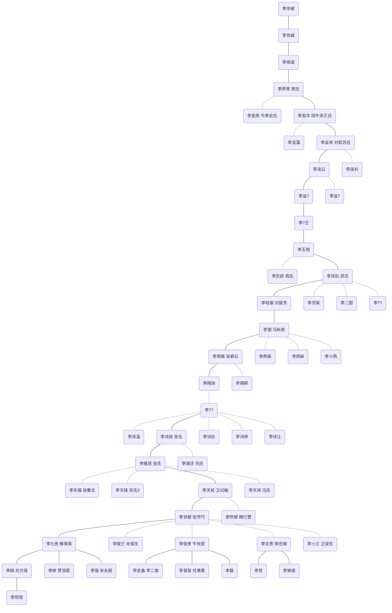

* content
{:toc}

## 心里学流派
- 构造主义
    - 心理学应研究人的直接经验即意识,并把人的经验分为感觉、意象和激情状态三种元素
    - 用内省的方法,找出构成人的心理的基本元素
    - 强调心理学的基本任务是理解正常成人的一般心理规律
- 行为主义
    - 反对研究意识,直接研究行为
    - 反对内省,主张采用实验法进行客观研究
- 格式塔心理学|完形心理学
    - 反对把心理现象分解为元素,主张从整体上研究心理现象
- 机能主义
    - 不把意识看成个别心理元素的集合,而是一种持续不断的过程
    - 意识的作用是使有机体适应环境
- 精神分析学派
    - 提出潜意识;主张人格结构的三层次;主张性欲论
- 人本主义心理学
    - 重视人自身的价值, 提倡充分发挥人的潜能 
- 认知心理学|信息加工心理学
    - 强调意识的能动性和人的主观能动性
    - 主张以信息加工观点为核

## 心里咨询流派
- 精神分析流派
    - 关注个体的无意识心理过程和童年经历对个体行为和心理健康的影响
    - 人的心理过程受到潜意识的影响,个体的行为和情感问题源于无意识中的冲突和欲望
    - 无意识、防御机制、性欲阶段、梦境解析
    - 通过解析潜意识中的冲突和过去经历，帮助个体增进自我认识和解决心理问题
    - 面对面的,个体被鼓励自由地表达他们的想法、情感、梦境和回忆.通过分析和解释这些内容,帮助个体理解潜意识中的问题和冲突，并促进个体的心理成长和变化
- 人本主义流派
    - 个体的自我实现和自我发展.对人类本质的积极看待,每个人都具有内在的自我价值和潜能
    - 人们具有自我决定的能力,追求自我实现和成长.关注个体的主观体验、自我意识和自我价值
    - 人的内在需求和动机对于心理健康至关重要.个体应该对自己的生活负责,并主动寻找意义和目标
    - 建立一个支持性、理解和接纳的咨询环境对于个体的成长和变化至关重要
    - 建立一个平等和互动的关系、鼓励个体自由地表达他们的感受、想法和需求
- 认知行为流派
    - 人的思维、情绪和行为之间的相互关系.个体的心理问题和困扰往往源自于错误、负面或不适应的思维模式和行为模式
    - 关注个体的认知过程,如注意力、思维、记忆和解释方式,以及行为模式,如习惯性的反应和应对方式
    - 认知三角是个体的思维、情绪和行为之间的相互关系.通过改变个体的思维方式,可以改变他们的情绪和行为反应
    - 认知错误和心理偏差,过度概括、放大缩小、黑白思维等
- 存在主义流派
    - 关注个体的存在和意义.个体是自由的、有责任的存在,通过自我选择和行动来赋予生活以意义
    - 对人类存在的本质和经验的探索.个体面临着生死、自由、孤独和意义等基本问题,
    - 关注对于生活和存在的感受和反应,个体通过超越自身的局限和平庸,追求更高的存在状态.
    - 通过提供支持、理解和挑战,帮助个体发现和赋予生活以意义,帮助他们更好地应对存在中的困扰和挑战
- 系统流派
    - 个体与其所处环境之间的关系和互动.个体和环境之间形成了一个相互作用的系统,变化一个部分会影响整个系统
    - 家庭系统理论,个体不是孤立存在的,是一个动态的互动系统,问题和困扰源自家庭系统的不平衡和功能失调
    - 通过观察和干预家庭系统的互动模式,可以促进个体和家庭的变化和发展

## 相关视频
- [认知行为取向的评估与治疗](https://www.bilibili.com/video/BV1Qg411w77e)
- [女孩身体莫名刺痛,身病还是"心病"](https://www.bilibili.com/video/BV1TR4y1W7V4)

