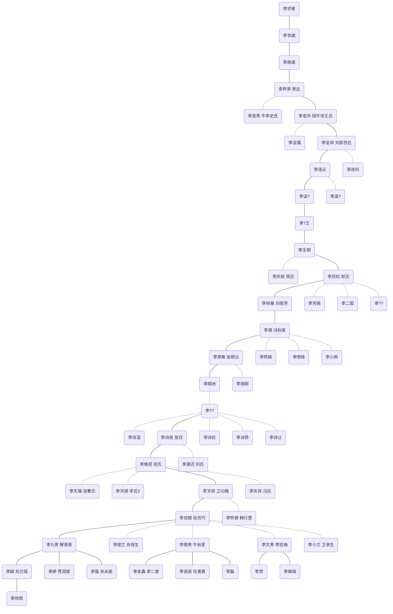

* content
{:toc}

```mermaid
graph TB

zp001001(李宗者)
zp002001(李世威)
zp003001(李继道)
zp004001(李养荣 贺氏)
zp005001(李愈秀 牛李史氏)
zp005002(李愈华 田牛宋王氏)
zp006001(李呈藻)
zp006002(李呈祥 刘郭苏氏)
zp007001(李连云)
zp007002(李连科)
zp008001(李溢?)
zp008002(李溢?)
zp009001(李?王)
zp010001(李玉相)
zp011001(李庆龄 周氏)
zp011002(李庆松 郭氏)
zp012001(李培基 刘俊芳)
zp012002(李芳英)
zp012003(李二囡)
zp012004(李??)
zp013001(李珉 冯秋英)
zp014001(李燕第 张颖云)
zp014002(李燕姝)
zp014003(李燕妹)
zp014004(李小燕)
zp015001(李翔洲)
zp015002(李翔邨)
zp01?00?(李??)
zp017001(李诗温)
zp017002(李诗良 张氏)
zp017003(李诗俭)
zp017004(李诗恭)
zp017005(李诗让)
zp018001(李维民 张氏)
zp018002(李谓还 刘氏)
zp019001(李天福 张曹氏)
zp019002(李天禄 宋氏3)
zp019003(李天祯 卫记梅)
zp019004(李天祥 冯氏)
zp020001(李双根 张芳巧)
zp020002(李然根 韩行慧)
zp021001(李九贵 解青英)
zp021002(李俊兰 肖保生)
zp021003(李俊贵 牛秋爱)
zp021004(李文贵 李忠梅)
zp021005(李小兰 卫录生)
zp022001(李娟 刘兰保)
zp022002(李婷 贾润斌)
zp022003(李强 宋永丽)
zp022004(李金鑫 李二俊)
zp022005(李苗苗 任勇勇)
zp022006(李磊)
zp022007(李哲)
zp022008(李姝瑶)
zp023001(李欣雨)

zp001001 --- zp002001
zp002001 --- zp003001
zp003001 --- zp004001
zp004001 -.- zp005001
zp004001 --- zp005002
zp005002 -.- zp006001
zp005002 --- zp006002
zp006002 --- zp007001
zp006002 -.- zp007002
zp007001 --- zp008001
zp007001 -.- zp008002
zp008001 --- zp009001
zp009001 --- zp010001
zp010001 -.- zp011001
zp010001 --- zp011002
zp011002 --- zp012001
zp011002 -.- zp012002
zp011002 -.- zp012003
zp011002 -.- zp012004
zp012001 --- zp013001
zp013001 --- zp014001
zp013001 -.- zp014002
zp013001 -.- zp014003
zp013001 -.- zp014004
zp014001 --- zp015001
zp014001 -.- zp015002
zp015001 -.- zp01?00?
zp01?00? -.- zp017001
zp01?00? --- zp017002
zp01?00? -.- zp017003
zp01?00? -.- zp017004
zp01?00? -.- zp017005
zp017002 --- zp018001
zp017002 -.- zp018002
zp018001 -.- zp019001
zp018001 -.- zp019002
zp018001 --- zp019003
zp018001 -.- zp019004
zp019003 --- zp020001
zp019003 -.- zp020002
zp020001 --- zp021001
zp020001 -.- zp021002
zp020001 -.- zp021003
zp020001 -.- zp021004
zp020001 -.- zp021005
zp021001 --- zp022001
zp021001 --- zp022002
zp021001 --- zp022003
zp021003 --- zp022004
zp021003 --- zp022005
zp021003 --- zp022006
zp021004 --- zp022007
zp021004 --- zp022008
zp022001 --- zp023001
```

