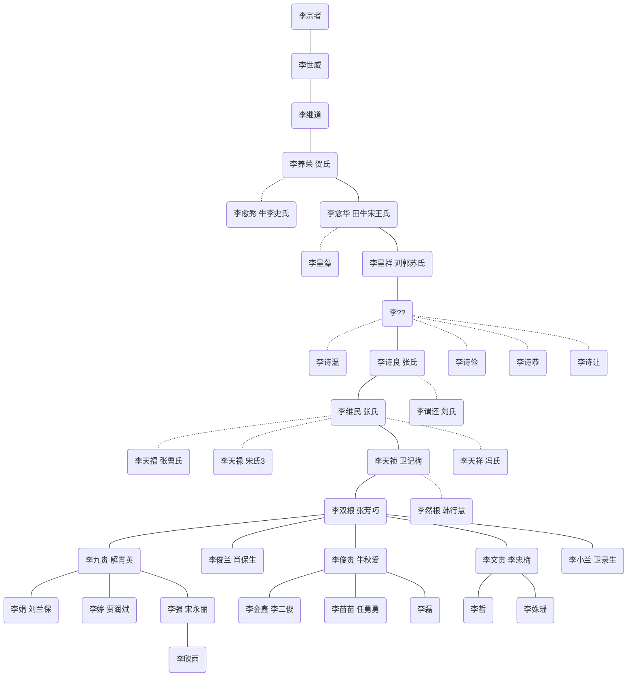

* content
{:toc}

```mermaid
graph TB

zp001001(李宗者)
zp002001(李世威)
zp003001(李继道)
zp004001(李养荣 贺氏)
zp005001(李愈秀 牛李史氏)
zp005002(李愈华 田牛宋王氏)
zp006001(李呈藻)
zp006002(李呈祥 刘郭苏氏)
zp01?00?(李??)
zp017001(李诗温)
zp017002(李诗良 张氏)
zp017003(李诗俭)
zp017004(李诗恭)
zp017005(李诗让)
zp018001(李维民 张氏)
zp018002(李谓还 刘氏)
zp019001(李天福 张曹氏)
zp019002(李天禄 宋氏3)
zp019003(李天祯 卫记梅)
zp019004(李天祥 冯氏)
zp020001(李双根 张芳巧)
zp020002(李然根 韩行慧)
zp021001(李九贵 解青英)
zp021002(李俊兰 肖保生)
zp021003(李俊贵 牛秋爱)
zp021004(李文贵 李忠梅)
zp021005(李小兰 卫录生)
zp022001(李娟 刘兰保)
zp022002(李婷 贾润斌)
zp022003(李强 宋永丽)
zp022004(李金鑫 李二俊)
zp022005(李苗苗 任勇勇)
zp022006(李磊)
zp022007(李哲)
zp022008(李姝瑶)
zp023001(李欣雨)

zp001001 --- zp002001
zp002001 --- zp003001
zp003001 --- zp004001
zp004001 -.- zp005001
zp004001 --- zp005002
zp005002 -.- zp006001
zp005002 --- zp006002
zp006002 --- zp01?00?
zp01?00? -.- zp017001
zp01?00? --- zp017002
zp01?00? -.- zp017003
zp01?00? -.- zp017004
zp01?00? -.- zp017005
zp017002 --- zp018001
zp017002 -.- zp018002
zp018001 -.- zp019001
zp018001 -.- zp019002
zp018001 --- zp019003
zp018001 -.- zp019004
zp019003 --- zp020001
zp019003 -.- zp020002
zp020001 --- zp021001
zp020001 --- zp021002
zp020001 --- zp021003
zp020001 --- zp021004
zp020001 --- zp021005
zp021001 --- zp022001
zp021001 --- zp022002
zp021001 --- zp022003
zp021003 --- zp022004
zp021003 --- zp022005
zp021003 --- zp022006
zp021004 --- zp022007
zp021004 --- zp022008
zp022003 --- zp023001
```

